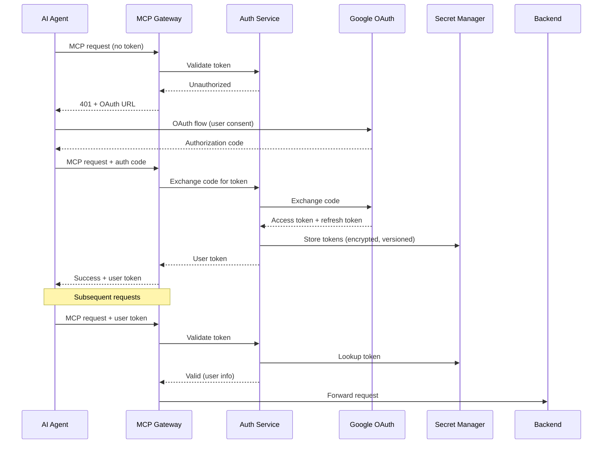

# BidShifter - Multi-Platform MCP Server Architecture

**Version:** 2.0
**Date:** January 2025
**Status:** Active Development

---

## Table of Contents

1. [Executive Summary](#executive-summary)
2. [Architecture Overview](#architecture-overview)
3. [Three MCP Servers](#three-mcp-servers)
4. [Core Design Principles](#core-design-principles)
5. [Service Boundaries](#service-boundaries)
6. [Data Layer Design](#data-layer-design)
7. [Infrastructure as Code](#infrastructure-as-code)
8. [Integration Patterns](#integration-patterns)
9. [Security Model](#security-model)
10. [Technology Stack](#technology-stack)
11. [Development Roadmap](#development-roadmap)
12. [Success Metrics](#success-metrics)
13. [Appendices](#appendices)

---

## Executive Summary

### Vision

BidShifter is an **AI-native, multi-platform programmatic advertising optimization system** built on three separate Model Context Protocol (MCP) servers. This architecture enables clean separation of concerns while maximizing composability and extensibility across advertising platforms (DV360, Google Ads, Meta, and future DSPs).

### Why Three MCP Servers?

By separating concerns into three distinct MCP servers, we achieve:

1. **Platform Independence** - `dbm-mcp` and `dv360-mcp` servers are generic, work across any ad platform
2. **Reusability** - Other applications can use `dbm-mcp`/`dv360-mcp` servers without optimization logic
3. **Composability** - AI agents can combine multiple MCP servers for novel workflows
4. **Maintainability** - Each server has clear boundaries and can be updated independently
5. **Scalability** - Each server scales based on its specific workload characteristics

### The Three Servers

1. **`dbm-mcp`** - Generic cross-platform reporting queries (read-only)
2. **`dv360-mcp`** - Generic campaign entity management (CRUD operations)
3. **`bidshifter-mcp`** - BidShifter-specific optimization intelligence (orchestrates other two)

### Strategic Approach

- **Monorepo Structure** - Single repository with shared types, unified deployment
- **Hybrid Architecture** - Three MCP servers for external API + shared library for internal performance
- **Platform-Agnostic Design** - Core logic independent of specific ad platforms
- **GCP-Only Architecture** - Cloud Run services for all compute, BigQuery for all data
- **AI-First Interface** - MCP tools as primary interface, humans as supervisors
- **Event-Driven Coordination** - Pub/Sub for asynchronous service communication
- **Performance-First** - Zero HTTP overhead for internal optimization workflows via shared library

### Expected Outcomes

1. **Multi-Platform Support** - Add new ad platforms in weeks, not months
2. **Cost Efficiency** - GCP-native architecture optimized for cost-effective scaling
3. **High Performance** - Zero HTTP overhead for internal workflows via hybrid architecture
4. **Operational Excellence** - AI agents handle routine optimization, humans focus on strategy
5. **Better Observability** - Complete audit trail of all decisions and platform interactions
6. **Composability** - External consumers can use MCP servers independently for novel workflows

### Architecture Evolution Notes

**Version 2.0 Updates** (January 2025):

This document has been updated to reflect **realistic performance considerations**:

1. **Hybrid Communication Pattern**: Added `@bidshifter/platform-lib` shared library to avoid HTTP overhead for internal optimization workflows while maintaining MCP servers for external composability.

2. **Performance Mitigation**: Added strategies for cold start impact (5-13s first-request latency), including minimum instances during business hours, keep-alive pings, and async task patterns.

**Key Architectural Decision**: Keep three separate MCP servers for external API surface (composability, reusability) while using shared library internally for performance. This "best of both worlds" approach delivers MCP benefits without sacrificing optimization workflow speed.

---

## Architecture Overview

### High-Level Design

```mermaid
graph TB
    subgraph "AI Clients"
        Claude[Claude Desktop/API]
        CustomAI[Custom AI Agents]
    end

    subgraph "GCP Cloud Run - MCP Servers"
        GW1[dbm-mcp]
        GW2[dv360-mcp]
        GW3[bidshifter-mcp]
    end

    subgraph "Shared Platform Library"
        PlatformLib[@bidshifter/platform-lib<br/>DeliveryService<br/>BidManagementService<br/>EntityService]
    end

    subgraph "MCP Server 1: dbm-mcp"
        RepTools[MCP Tools]
        RepSvc[Uses platform-lib]
    end

    subgraph "MCP Server 2: dv360-mcp"
        MgmtTools[MCP Tools]
        MgmtSvc[Uses platform-lib]
    end

    subgraph "MCP Server 3: bidshifter-mcp"
        OptTools[MCP Tools & Prompts]
        OptSvc[Optimization Engine<br/>Uses platform-lib directly]
    end

    subgraph "GCP - Data Layer"
        BQ[(BigQuery<br/>All Data Storage)]
        Storage[(Cloud Storage)]
        PubSub[Pub/Sub]
    end

    subgraph "External APIs"
        DV360API[DV360 API]
        GAdsAPI[Google Ads API]
        MetaAPI[Meta API]
    end

    Claude -->|MCP Protocol<br/>HTTP| GW1
    Claude -->|MCP Protocol<br/>HTTP| GW2
    Claude -->|MCP Protocol<br/>HTTP| GW3
    CustomAI -->|MCP Protocol<br/>HTTP| GW1
    CustomAI -->|MCP Protocol<br/>HTTP| GW2

    GW1 --> RepTools
    GW2 --> MgmtTools
    GW3 --> OptTools

    RepTools --> RepSvc
    MgmtTools --> MgmtSvc
    OptTools --> OptSvc

    RepSvc -.->|imports| PlatformLib
    MgmtSvc -.->|imports| PlatformLib
    OptSvc -.->|imports<br/>DIRECT CALLS<br/>Zero HTTP| PlatformLib

    OptSvc -.->|External API only<br/>HTTP calls| GW1
    OptSvc -.->|External API only<br/>HTTP calls| GW2

    PlatformLib --> BQ
    PlatformLib --> Storage
    PlatformLib --> DV360API
    PlatformLib --> GAdsAPI
    PlatformLib --> MetaAPI
    PlatformLib --> PubSub

    style OptSvc fill:#e1f5e1
    style PlatformLib fill:#fff4e1

    classDef internalPath stroke:#00aa00,stroke-width:3px
    classDef externalPath stroke:#0066cc,stroke-width:2px,stroke-dasharray: 5 5

    class OptSvc,PlatformLib internalPath
```

**Architecture Notes**:

1. **Dual-Path Design**:
   - **External Path (dashed blue)**: AI agents call MCP servers via HTTP
   - **Internal Path (solid green)**: bidshifter-mcp uses shared library directly, zero HTTP overhead

2. **Shared Platform Library** (`@bidshifter/platform-lib`):
   - Contains all business logic for delivery queries, bid management, entity fetching
   - Used by all three MCP servers
   - Enables bidshifter-mcp to bypass HTTP calls for performance

3. **Why This Works**:
   - MCP servers remain composable for external consumers
   - Internal optimization workflows get native performance
   - No code duplication - single source of truth in platform library
   - Best of both worlds: composability + performance

### Key Architectural Concepts

#### 1. **Three Independent MCP Servers**

Each MCP server is a complete, deployable unit with its own:

- Cloud Run service implementing MCP protocol
- Business logic and platform adapters
- MCP tool definitions
- JWT authentication and authorization

#### 2. **Hybrid Communication Pattern**

**External Consumers** (AI agents, other apps) call MCP servers via HTTP:

```typescript
// External AI agent calling dbm-mcp
const deliveryData = await fetch("https://dbm.bidshifter.io/mcp", {
  method: "POST",
  headers: { "Authorization": "Bearer <token>" },
  body: JSON.stringify({
    jsonrpc: "2.0",
    method: "tools/call",
    params: {
      name: "get_campaign_delivery",
      arguments: { campaignId, dateRange },
    },
  }),
});
```

**Internal Optimization** (bidshifter-mcp) uses shared library for zero-overhead calls:

```typescript
// Inside bidshifter-mcp service - NO HTTP calls
import { DeliveryService } from "@bidshifter/platform-lib";

const deliveryService = new DeliveryService();
const deliveryData = await deliveryService.getCampaignDelivery({
  campaignId,
  dateRange
});
// Direct BigQuery access via shared library - 0ms network overhead
```

**Why Hybrid?**
- **Performance**: Internal optimizations avoid 50+ HTTP round trips
- **Composability**: External consumers can still use MCP servers independently
- **Code Reuse**: MCP servers use same platform library, no duplication
- **Best of Both Worlds**: Get MCP benefits (discoverability, standardization) without performance penalty

#### 3. **Platform-Agnostic Data Layer**

All platform-specific data is normalized into unified BigQuery schemas:

- **Raw tables**: `bidshifter_raw_dv360.*`, `bidshifter_raw_google_ads.*`
- **Normalized tables**: `bidshifter.campaigns_dim`, `bidshifter.delivery_metrics_fact`
- **ETL jobs**: Hourly transformation from raw to normalized

#### 4. **Event-Driven Coordination**

Services communicate via Pub/Sub for:

- Audit trails (all bid adjustments logged)
- Cache invalidation (when data changes)
- Async workflows (optimization tasks)
- Cross-service notifications

---

## Three MCP Servers

### Server 1: `dbm-mcp`

**Purpose**: Generic cross-platform reporting queries (read-only operations)

**MCP Tools Exposed**:

- `get_campaign_delivery` - Fetch delivery metrics (impressions, clicks, spend) for date range
- `get_performance_metrics` - Get calculated metrics (CPM, CTR, CPA, ROAS)
- `get_historical_metrics` - Time-series data for trend analysis
- `get_platform_entities` - Fetch campaign hierarchy (advertisers → campaigns → line items)
- `get_pacing_status` - Real-time pacing calculation vs. expected delivery

**MCP Resources Exposed**:

- `report://daily-metrics/{advertiserId}/{date}` - Daily aggregate metrics
- `report://campaign-status/{campaignId}` - Current campaign status snapshot

**Platform Integrations** (internal services, not MCP-exposed):

- DV360: Bid Manager API v2 for performance reports
- Google Ads: Google Ads API reporting endpoints
- Meta: Marketing API insights
- Future: The Trade Desk, Amazon DSP, etc.

**Data Sources**:

- BigQuery normalized tables (primary source)
- Platform APIs for real-time data (< 24 hours old)

**Key Characteristics**:

- **Read-only**: No mutations, safe to call repeatedly
- **Platform-agnostic**: Same tools work across DV360, Google Ads, Meta
- **Normalized schemas**: Consistent data structure regardless of source platform

---

### Server 2: `dv360-mcp`

**Purpose**: Generic campaign entity management (CRUD operations across platforms)

**MCP Tools Exposed**:

- `fetch_campaign_entities` - Retrieve full campaign hierarchy from platform
- `update_campaign_budget` - Change campaign/IO budget
- `update_campaign_dates` - Adjust flight start/end dates
- `update_line_item_status` - Pause/activate line items
- `update_line_item_bid` - Change CPM/CPC bid (manual, non-optimization)
- `update_revenue_margin` - Adjust margin for revenue-based line items
- `create_line_item` - Create new line items (future)

**Platform Integrations** (internal services):

- DV360: SDF download/upload + API v4 for mutations
- Google Ads: Google Ads API mutation endpoints
- Meta: Marketing API writes
- Future: Additional DSP integrations

**Data Sources/Targets**:

- Platform APIs (write operations)
- Cloud Storage (SDF file staging for DV360)
- Pub/Sub (publish change events for audit trail)
- BigQuery (operation state tracking in `pending_adjustments` table)

**Key Characteristics**:

- **Write operations**: Mutates campaign entities on advertising platforms
- **Platform-specific adapters**: Each platform has dedicated service implementation
- **Audit trail**: All changes logged to BigQuery via Pub/Sub events
- **Idempotency**: Safe retry logic for failed operations

---

### Server 3: `bidshifter-mcp`

**Purpose**: BidShifter-specific optimization intelligence (orchestrates other two servers)

**MCP Tools Exposed**:

- `optimize_campaign_bids` - Analyze pacing and calculate bid adjustments
- `adjust_revenue_margin` - Optimize margin-based revenue line items
- `get_optimization_recommendations` - Dry-run mode for suggested changes
- `get_adjustment_history` - Track optimization decisions over time
- `get_pacing_forecast` - Project future delivery based on current trends
- `configure_optimization` - Set optimization strategy and thresholds

**MCP Prompts Exposed**:

- `campaign_optimization_workflow` - Guide AI through full optimization process
- `troubleshoot_underdelivery` - Debug pacing issues systematically
- `margin_optimization_strategy` - Margin-specific optimization guidance

**MCP Resources Exposed**:

- `optimization://tasks/{taskId}` - Async optimization job status
- `optimization://config/{campaignId}` - Current optimization configuration

**Dependencies** (calls other MCP servers internally):

- **Uses `dbm-mcp`**: Fetch delivery data, calculate pacing offsets
- **Uses `dv360-mcp`**: Execute bid/margin changes on platforms
- BigQuery:
  - Historical adjustment analysis and effectiveness scoring
  - Optimization configuration (`optimization_config` table)
  - Task state tracking (`optimization_tasks` table)
- Pub/Sub: Publish optimization events for audit and notifications

**Key Characteristics**:

- **Platform-agnostic logic**: All optimization algorithms independent of platform
- **Orchestrator**: Calls `dbm-mcp` + `dv360-mcp` servers to accomplish goals
- **Stateful**: Tracks optimization tasks, learns from historical adjustments
- **Proprietary intelligence**: Contains BidShifter's optimization algorithms

**Scheduled Functions** (not MCP-exposed):

- `scheduled_optimization_scan` - Every 4 hours, identify campaigns needing optimization
- `scheduled_adjustment_executor` - Every 30 minutes, process queued adjustments
- `scheduled_outcome_tracker` - Daily, measure effectiveness of past adjustments

---

## Core Design Principles

### 1. MCP-First Design

**Principle**: Every capability is exposed as MCP primitives (tools, resources, prompts) before any other interface.

**Rationale**:

- AI agents are the primary users of this system
- MCP provides standardized, discoverable, self-documenting APIs
- Forces clear separation between intent (what to do) and implementation (how to do it)
- Enables rapid composition of complex workflows by AI systems

**Implementation**:

- All services expose MCP tool definitions with JSON Schema parameters
- Resources provide read-only access to campaign data and metrics
- Prompts guide AI agents through complex optimization scenarios
- No HTTP endpoints exposed directly - all access via MCP protocol

**Example**:

```typescript
// Tool definition
{
  name: "optimize_campaign_bids",
  description: "Analyzes campaign performance and adjusts CPM bids to achieve pacing and performance goals",
  inputSchema: {
    type: "object",
    properties: {
      advertiserId: { type: "string", description: "DV360 Advertiser ID" },
      insertionOrderId: { type: "string", description: "Insertion Order ID to optimize" },
      strategy: {
        type: "string",
        enum: ["aggressive", "moderate", "conservative"],
        description: "Optimization aggressiveness"
      }
    },
    required: ["advertiserId", "insertionOrderId"]
  }
}
```

---

### 2. Domain-Driven Modularity

**Principle**: Services are organized around business domains and capabilities, not technical layers.

**Rationale**:

- Each service has clear ownership and boundaries
- Teams can work independently on different domains
- Reduces coupling - changes in one domain don't cascade
- Aligns with how humans reason about the system

**Implementation**:

- 8 core services: Auth, DisplayVideo, Reporting, Optimization, Historical, Orchestration, Notification, Gateway
- Each service owns its data models, business logic, and MCP tool definitions
- Services communicate via events (Pub/Sub), not direct calls
- Shared code limited to types and utilities

**Anti-pattern to avoid**:

```
❌ services/
    ├── api-layer/      # Technical layer
    ├── business-layer/ # Technical layer
    └── data-layer/     # Technical layer
```

**Correct approach**:

```
✅ services/
    ├── auth/           # Domain
    ├── displayvideo/   # Domain
    ├── reporting/      # Domain
    └── optimization/   # Domain
```

---

### 3. Direct Cloud Run MCP Servers

**Principle**: Each MCP server is a Cloud Run service that directly implements the MCP protocol via HTTP transport.

**Rationale**:

- MCP is not high-frequency traffic - cold starts are acceptable (1-3s)
- Most operations are writes (bid adjustments, budget changes) - not cacheable
- Simpler architecture without edge layer reduces operational complexity
- Cloud Run auto-scales to zero when idle - cost-efficient
- Direct HTTP transport is standard MCP pattern

**Implementation**:

- Each Cloud Run service exposes `/mcp` endpoint implementing JSON-RPC 2.0
- JWT authentication for all requests via Authorization header
- Request/response logging to Cloud Logging
- Auto-scaling: 0-10 instances based on traffic
- Memory: 512 MiB (reporting/management), 2 GiB (optimization)

**Cost Impact**:

- Cloud Run (all services): $120/month for medium workload
- No edge layer complexity or additional CDN costs
- Total infrastructure: ~$175/month vs $800/month Firebase

---

### 4. All Compute on GCP Cloud Run

**Principle**: All business logic, API integrations, and data processing run on GCP Cloud Run.

**Rationale**:

- Optimization algorithms need CPU/memory for complex calculations
- Deep integration with BigQuery for analytics queries
- Cloud Run scales to zero when idle, only pay for actual compute time
- Regional deployment in europe-west2 for data residency compliance
- Unified platform reduces operational overhead

**Implementation**:

- Each service is a containerized Cloud Run service
- Auto-scaling based on request concurrency (1-100 instances)
- Memory: 2-4 GiB for optimization service, 512 MiB for others
- Timeout: 5 minutes for long-running optimizations
- VPC connector for secure access to internal resources

**Services requiring heavy compute**:

- **Optimization Service**: Bid calculations, pacing algorithms, budget allocation
- **Reporting Service**: BigQuery aggregations, metric calculations
- **DisplayVideo Service**: SDF file processing (CSV parsing/manipulation)
- **Historical Service**: Machine learning on adjustment effectiveness

---

### 5. Stateless Services

**Principle**: All services are stateless; all state lives in managed storage (BigQuery, Cloud Storage, Secret Manager).

**Rationale**:

- Enables horizontal scaling without coordination
- Simplifies deployment - any instance can handle any request
- Improves reliability - instance failures don't lose state
- Cloud-native best practice
- Single data store (BigQuery) simplifies queries and reduces operational complexity

**Implementation**:

- No in-memory session storage or caches beyond request scope
- OAuth tokens stored in Secret Manager (encrypted, automatic rotation)
- Campaign configuration in BigQuery `optimization_config` table
- Historical adjustments in BigQuery `adjustments_changelog` table
- SDF files in Cloud Storage buckets
- Task state in BigQuery `optimization_tasks` table

**State Storage Strategy**:
| State Type | Storage | TTL | Rationale |
|------------|---------|-----|-----------|
| OAuth tokens | Secret Manager | 1 hour | Encrypted, automatic rotation, versioning |
| Campaign config | BigQuery | - | Queryable, supports complex filters, audit trail |
| Adjustment history | BigQuery | - | Analytics, time-series queries, ML training data |
| SDF files | Cloud Storage | 7 days | Large CSV files, versioning, lifecycle policies |
| Task state | BigQuery | 30 days | Queryable status, supports complex queries, automatic expiry |
| Pending adjustments | BigQuery | 24 hours | Queue implementation via SQL queries, ACID guarantees |

---

### 6. Event-Driven Communication (For Notifications Only)

**⚠️ CRITICAL ARCHITECTURAL DECISION**: Pub/Sub is **NOT** used for core business operations. It is **ONLY** for notifications and analytics.

**Principle**: Pub/Sub is used for **notifications, analytics, and non-critical workflows**. Core business operations (bid adjustments, data writes) are **synchronous and transactional**.

**Rationale**:

- **Critical operations need transaction guarantees**: Bid adjustments must succeed or fail atomically
- **Eventual consistency is dangerous**: Can't have DV360 updated but BigQuery history missing
- **Caller needs immediate feedback**: User must know if optimization succeeded or failed
- **Pub/Sub is for notifications**: Alerts, analytics, cache invalidation hints, scheduled jobs

**What Pub/Sub IS good for**:

- ✅ User notifications (Slack, email) after operations complete
- ✅ Analytics updates (dashboards, reporting) with eventual consistency
- ✅ Scheduled batch jobs (scan campaigns, cleanup tasks)
- ✅ Non-critical alerts (low-priority monitoring)

**What Pub/Sub is NOT good for**:

- ❌ Core business logic (bid adjustments, budget changes)
- ❌ Audit trail recording (must be synchronous with operation)
- ❌ Cache invalidation that must complete before returning
- ❌ Operations where caller needs immediate success/failure feedback

**Implementation**:

- Core Pub/Sub topics (notifications only, not business logic):
  - `optimization.completed` - Optimization → Notification (alert users of completed optimizations)
  - `optimization.failed` - Optimization → Notification (alert users of failures)
  - `entities.refreshed` - DisplayVideo → Cache invalidation (when fresh entities fetched)
  - `reports.generated` - Reporting → Analytics dashboards
  - `errors.critical` - Any service → Notification (alert on-call team)

**IMPORTANT**: Pub/Sub is NOT used for core business operations (bid adjustments, data writes). Those are synchronous and transactional.

**Event Flow Example** (Optimization Workflow):

```
1. AI Agent calls tool: optimize_campaign_bids
2. bidshifter-mcp calculates adjustments
3. bidshifter-mcp applies to DV360 (via platform-lib) - SYNCHRONOUS
4. bidshifter-mcp records to BigQuery - SYNCHRONOUS
5. bidshifter-mcp invalidates cache - SYNCHRONOUS
6. bidshifter-mcp returns results to caller
7. bidshifter-mcp publishes: optimization.completed (notification only) - ASYNCHRONOUS
8. Notification Service consumes event, sends alerts
```

**Key Principle**: Core business operations (apply bids, record history) are **synchronous and transactional**. Notifications and analytics are **asynchronous via Pub/Sub**.

**Synchronous vs Asynchronous Decision Matrix**:
| Scenario | Communication | Rationale |
|----------|---------------|-----------|
| MCP tool call → immediate result | Synchronous (direct lib call) | User waiting for response, needs transaction guarantee |
| Critical business operations (bid adjustments) | Synchronous (direct lib call) | Must be transactional and return status |
| Notifications after operations | Async (Pub/Sub) | Fire-and-forget, non-critical |
| Analytics/reporting updates | Async (Pub/Sub) | Eventual consistency acceptable |
| Scheduled batch operations | Async (Pub/Sub) | Asynchronous by nature |

---

### 7. Type-Safe Contracts

**Principle**: TypeScript with Zod validation at all service boundaries; shared type definitions across services.

**Rationale**:

- Catch integration errors at build time, not runtime
- Self-documenting APIs - types serve as specification
- Zod provides runtime validation + static types from single source of truth
- Reduces bugs from malformed data at service boundaries

**Implementation**:

- Monorepo structure with shared `@bidshifter/types` package
- Zod schemas for all MCP tool parameters and responses
- Strict TypeScript configuration (all strict flags enabled)
- Code generation for DV360 API types from OpenAPI spec

**Shared Types Package**:

```typescript
// @bidshifter/types/src/mcp.ts
import { z } from "zod";

export const OptimizeCampaignBidsParamsSchema = z.object({
  advertiserId: z.string().regex(/^\d+$/, "Must be numeric advertiser ID"),
  insertionOrderId: z
    .string()
    .regex(/^\d+$/, "Must be numeric insertion order ID"),
  strategy: z
    .enum(["aggressive", "moderate", "conservative"])
    .default("moderate"),
  dryRun: z.boolean().default(false),
});

export type OptimizeCampaignBidsParams = z.infer<
  typeof OptimizeCampaignBidsParamsSchema
>;

export const OptimizeCampaignBidsResponseSchema = z.object({
  taskId: z.string().uuid(),
  status: z.enum(["queued", "processing", "completed", "failed"]),
  adjustments: z
    .array(
      z.object({
        lineItemId: z.string(),
        previousCpm: z.number(),
        newCpm: z.number(),
        reason: z.string(),
      })
    )
    .optional(),
});

export type OptimizeCampaignBidsResponse = z.infer<
  typeof OptimizeCampaignBidsResponseSchema
>;
```

**Boundary Validation**:

```typescript
// In Optimization Service
import { OptimizeCampaignBidsParamsSchema } from "@bidshifter/types";

export async function handleOptimizeRequest(rawParams: unknown) {
  // Runtime validation with Zod
  const params = OptimizeCampaignBidsParamsSchema.parse(rawParams);
  // TypeScript now knows params is OptimizeCampaignBidsParams

  // Business logic...
}
```

---

### 8. Observable by Default

**Principle**: Structured logging, distributed tracing, and metrics are first-class concerns, not afterthoughts.

**Rationale**:

- AI agents need visibility into system behavior to make decisions
- Debugging distributed systems requires correlated logs across services
- Performance optimization requires metrics at every layer
- Audit compliance requires complete operation history

**Implementation**:

- **Structured Logging**: JSON logs with trace IDs, service name, operation name
- **Distributed Tracing**: OpenTelemetry spans across Worker → Cloud Run → External APIs
- **Metrics**: Custom metrics for optimization effectiveness, API latency, cost per optimization
- **Dashboards**: Grafana dashboards for real-time monitoring

**Observability Stack**:

- Cloud Run → Cloud Logging (structured JSON)
- Traces → Cloud Trace (OpenTelemetry)
- Metrics → Cloud Monitoring (custom metrics)
- Alerts → Cloud Monitoring → Notification Service → Slack/Email
- BigQuery → Log analytics and historical analysis

**Structured Log Format**:

```typescript
{
  "timestamp": "2025-10-31T10:30:00.000Z",
  "severity": "INFO",
  "trace": "projects/bidshifter/traces/4bf92f3577b34da6a3ce929d0e0e4736",
  "spanId": "00f067aa0ba902b7",
  "service": "optimization-service",
  "operation": "calculate_bid_adjustments",
  "advertiserId": "12345",
  "insertionOrderId": "67890",
  "message": "Calculated 15 bid adjustments",
  "metadata": {
    "adjustmentCount": 15,
    "avgBidIncrease": 0.12,
    "pacingImprovement": 0.05,
    "processingTimeMs": 450
  }
}
```

**Key Metrics**:

- **Optimization Effectiveness**: `bid_adjustment_impact_score` (goal offset improvement per adjustment)
- **System Performance**: `tool_call_latency_ms`, `pubsub_processing_lag_seconds`, `cold_start_frequency`
- **Cost Efficiency**: `cost_per_optimization_usd`, `compute_time_per_campaign_seconds`
- **Reliability**: `error_rate`, `retry_count`, `task_failure_rate`

---

### 9. Cost-Conscious Architecture

**Principle**: Every architectural decision considers cost implications; optimize for cost without sacrificing performance.

**Rationale**:

- Firebase Functions were expensive ($500-1000/month for moderate usage)
- Serverless compute can get costly at scale if not designed carefully
- Right-sized compute + unified storage can reduce costs by 40-60%
- Budget-conscious design enables sustainable growth

**Cost Optimization Strategies**:

#### a) **Right-Sized Compute**

- Optimization Service: 2 GiB memory, max 10 concurrent instances
- Reporting Service: 1 GiB memory, max 20 instances (CPU-bound)
- Other services: 512 MiB memory, max 5 instances
- **Savings**: Pay only for required resources, ~$100/month vs over-provisioning

#### b) **Batch Processing**

- Process multiple line items in single optimization run
- Bulk DV360 API updates (batch 100 line items per SDF upload)
- Aggregate BigQuery inserts (buffer 1000 rows or 5 minutes)
- **Savings**: Reduces API costs and compute time by 60%

#### c) **Scale to Zero**

- Cloud Run scales to zero during off-peak hours (8pm-6am CET)
- Only pay for compute during active optimization windows
- **Savings**: 10 hours/day of zero cost = 40% reduction

#### d) **BigQuery Cost Controls**

- Partition tables by date (only scan required date ranges)
- Cluster tables by advertiser ID (reduce scan for advertiser-specific queries)
- Materialized views for common aggregations
- **Savings**: Reduce query costs from $5/TB to $1/TB with partitioning

**GCP Infrastructure Components**:

The architecture leverages GCP-native services for optimal performance:
- **Cloud Run**: Serverless containers with automatic scaling
- **BigQuery**: Data warehouse for queries and analytics
- **Cloud Storage**: Object storage for SDF files
- **Pub/Sub**: Event streaming for async communication
- **Secret Manager**: Secure credential storage

---

### 10. AI-Native Operations

**Principle**: The system is designed for AI agents as the primary interface, with humans as supervisors.

**Rationale**:

- Routine optimization should be automated by AI agents
- Humans should focus on strategy, not tactical bid adjustments
- AI agents can react faster to pacing issues than daily manual reviews
- MCP enables transparent, auditable AI decision-making

**AI Agent Capabilities**:

#### a) **Autonomous Optimization**

- AI agent monitors campaign pacing every 4 hours
- Calls `optimize_campaign_bids` tool when pacing < 90% or > 105%
- Reviews adjustment recommendations, approves or modifies
- Logs all decisions with reasoning for human review

#### b) **Proactive Alerting**

- AI agent queries `get_campaign_status` resource hourly
- Detects anomalies (sudden pacing drop, goal performance degradation)
- Calls `send_alert` tool with natural language summary
- Suggests potential causes and remediation steps

#### c) **Performance Analysis**

- Human asks: "Why did campaign X underdeliver yesterday?"
- AI agent calls `get_delivery_report` and `get_historical_adjustments` resources
- Analyzes correlation between adjustments and performance
- Provides natural language explanation with supporting data

#### d) **Strategic Planning**

- Human asks: "Should we increase budget for campaign Y next month?"
- AI agent calls `get_forecast` tool with increased budget scenario
- Compares projected vs current performance
- Provides recommendation with confidence level and risk factors

**MCP Prompts for AI Guidance**:

```typescript
// Prompt: campaign_optimization_workflow
{
  name: "campaign_optimization_workflow",
  description: "Guides AI agents through the complete campaign optimization workflow",
  arguments: [
    { name: "advertiserId", required: true },
    { name: "optimizationGoal", required: true }
  ],
  content: `
You are optimizing campaigns for advertiser {{advertiserId}} with goal: {{optimizationGoal}}.

Follow this workflow:

1. **Assessment Phase**
   - Call get_campaign_status for all active campaigns
   - Identify campaigns with pacing < 90% (underdelivering) or > 105% (overdelivering)
   - Check goal performance: is KPI within 10% of target?

2. **Analysis Phase**
   - For underdelivering campaigns:
     - Call get_historical_adjustments to see recent bid changes
     - Check if previous increases were effective (did pacing improve?)
     - Call get_competitive_landscape to see if market CPMs increased

   - For overdelivering campaigns:
     - Verify budget won't be exhausted early
     - Check if goal performance is still on target (may be worth keeping higher delivery)

3. **Decision Phase**
   - For each campaign requiring adjustment:
     - Calculate recommended CPM change (use optimize_campaign_bids with dryRun=true)
     - Review adjustment reasoning
     - If adjustment seems reasonable (< 20% change), approve
     - If adjustment is aggressive (> 20%), flag for human review

4. **Execution Phase**
   - Call optimize_campaign_bids for approved adjustments
   - Call send_alert to notify team of changes
   - Schedule follow-up check in 24 hours

5. **Monitoring Phase**
   - After 24 hours, call get_delivery_report
   - Compare actual vs expected pacing improvement
   - If pacing didn't improve, investigate (budget caps? targeting issues?)

Remember: Be conservative. Small, frequent adjustments are better than large, infrequent ones.
`
}
```

---

## MCP Server Architecture

### MCP Protocol Implementation

BidShifter implements the full MCP specification with tools, resources, and prompts.

#### MCP Capabilities

```typescript
// Server capabilities response
{
  "protocolVersion": "2024-11-05",
  "capabilities": {
    "tools": {
      "listChanged": true  // Server notifies when tool list changes
    },
    "resources": {
      "subscribe": true,   // Clients can subscribe to resource updates
      "listChanged": true
    },
    "prompts": {
      "listChanged": true
    },
    "logging": {}          // Server sends logs to client
  },
  "serverInfo": {
    "name": "bidshifter-mcp-server",
    "version": "1.0.0"
  }
}
```

---

### MCP Tools

Tools represent **actions** that AI agents can take. Each tool maps to a specific business capability.

#### Optimization Tools

**1. `optimize_campaign_bids`**

```typescript
{
  name: "optimize_campaign_bids",
  description: "Analyzes campaign performance and adjusts CPM bids to achieve pacing and performance goals. Use this when campaigns are under/over-delivering.",
  inputSchema: {
    type: "object",
    properties: {
      advertiserId: {
        type: "string",
        description: "DV360 Advertiser ID (numeric)"
      },
      insertionOrderId: {
        type: "string",
        description: "Insertion Order ID to optimize. Optimizes all line items within this IO."
      },
      strategy: {
        type: "string",
        enum: ["aggressive", "moderate", "conservative"],
        default: "moderate",
        description: "Optimization aggressiveness: aggressive=±5% CPM, moderate=±2%, conservative=±1%"
      },
      dryRun: {
        type: "boolean",
        default: false,
        description: "If true, returns recommended adjustments without applying them"
      },
      targetPacing: {
        type: "number",
        minimum: 0,
        maximum: 100,
        default: 95,
        description: "Target pacing percentage (e.g., 95 = aim for 95% of expected delivery)"
      }
    },
    required: ["advertiserId", "insertionOrderId"]
  }
}
```

**Response**:

```typescript
{
  content: [
    {
      type: "text",
      text: JSON.stringify({
        taskId: "550e8400-e29b-41d4-a716-446655440000",
        status: "completed",
        summary: {
          lineItemsAnalyzed: 24,
          adjustmentsMade: 15,
          avgBidChange: "+12%",
          estimatedPacingImpact: "+8%",
        },
        adjustments: [
          {
            lineItemId: "12345",
            lineItemName: "Prospecting - Desktop",
            previousCpm: 2.5,
            newCpm: 2.8,
            changePercent: 12,
            reason:
              "Underdelivering at 75% pacing, goal performance within target",
            pacingBefore: 75,
            estimatedPacingAfter: 83,
          },
          // ... more adjustments
        ],
      }),
    },
  ];
}
```

**2. `adjust_line_item_bid`**

```typescript
{
  name: "adjust_line_item_bid",
  description: "Manually adjusts CPM bid for a specific line item. Use for fine-tuned control or when automated optimization isn't appropriate.",
  inputSchema: {
    type: "object",
    properties: {
      lineItemId: { type: "string", description: "Line Item ID" },
      newCpm: { type: "number", minimum: 0.01, description: "New CPM bid in campaign currency" },
      reason: { type: "string", description: "Reason for manual adjustment (for audit trail)" }
    },
    required: ["lineItemId", "newCpm", "reason"]
  }
}
```

**3. `adjust_revenue_margin`**

```typescript
{
  name: "adjust_revenue_margin",
  description: "Adjusts margin percentage for margin-based revenue line items. Affects both bid and margin simultaneously.",
  inputSchema: {
    type: "object",
    properties: {
      lineItemId: { type: "string" },
      newMarginPercent: { type: "number", minimum: 0, maximum: 100 },
      reason: { type: "string" }
    },
    required: ["lineItemId", "newMarginPercent", "reason"]
  }
}
```

#### Reporting Tools

**4. `get_campaign_status`**

```typescript
{
  name: "get_campaign_status",
  description: "Retrieves current status for all campaigns (insertion orders) under an advertiser, including pacing, spend, and goal performance.",
  inputSchema: {
    type: "object",
    properties: {
      advertiserId: { type: "string", description: "DV360 Advertiser ID" },
      dateRange: {
        type: "string",
        enum: ["today", "yesterday", "last_7_days", "last_30_days", "flight_to_date"],
        default: "today"
      }
    },
    required: ["advertiserId"]
  }
}
```

**Response**:

```typescript
{
  content: [
    {
      type: "text",
      text: JSON.stringify({
        advertiserId: "12345",
        advertiserName: "ACME Corp",
        reportDate: "2025-10-31",
        dateRange: "today",
        campaigns: [
          {
            insertionOrderId: "67890",
            insertionOrderName: "Q4 Prospecting",
            status: "ACTIVE",
            flightStart: "2025-10-01",
            flightEnd: "2025-12-31",
            budget: {
              total: 100000,
              spent: 42500,
              remaining: 57500,
              currency: "USD",
            },
            pacing: {
              actual: 42.5,
              expected: 48.4,
              offset: -5.9,
              status: "underdelivering",
            },
            goal: {
              type: "CPA",
              target: 50,
              actual: 48.5,
              offset: -3.0,
              status: "on_target",
            },
            metrics: {
              impressions: 850000,
              clicks: 4250,
              conversions: 876,
              spend: 42500,
              cpm: 50.0,
              ctr: 0.5,
              cpa: 48.5,
            },
            lineItemCount: 24,
            activeLineItemCount: 20,
          },
          // ... more campaigns
        ],
      }),
    },
  ];
}
```

**5. `get_delivery_report`**

```typescript
{
  name: "get_delivery_report",
  description: "Generates detailed delivery report for a specific campaign or line item with daily breakdowns.",
  inputSchema: {
    type: "object",
    properties: {
      entityType: { type: "string", enum: ["insertion_order", "line_item"] },
      entityId: { type: "string" },
      startDate: { type: "string", format: "date" },
      endDate: { type: "string", format: "date" },
      metrics: {
        type: "array",
        items: { type: "string" },
        default: ["impressions", "clicks", "conversions", "spend"]
      }
    },
    required: ["entityType", "entityId", "startDate", "endDate"]
  }
}
```

**6. `get_historical_adjustments`**

```typescript
{
  name: "get_historical_adjustments",
  description: "Retrieves history of bid/margin adjustments for a line item, showing what was changed and the impact.",
  inputSchema: {
    type: "object",
    properties: {
      lineItemId: { type: "string" },
      lookbackDays: { type: "number", default: 30, minimum: 1, maximum: 90 }
    },
    required: ["lineItemId"]
  }
}
```

#### Data Management Tools

**7. `fetch_campaign_entities`**

```typescript
{
  name: "fetch_campaign_entities",
  description: "Fetches fresh campaign structure from DV360 (advertisers, insertion orders, line items). Use to sync configuration.",
  inputSchema: {
    type: "object",
    properties: {
      advertiserId: { type: "string" },
      forceRefresh: { type: "boolean", default: false, description: "Bypass cache and fetch fresh from API" }
    },
    required: ["advertiserId"]
  }
}
```

**8. `update_campaign_configuration`**

```typescript
{
  name: "update_campaign_configuration",
  description: "Updates optimization configuration for an insertion order (goals, pacing targets, adjustment limits).",
  inputSchema: {
    type: "object",
    properties: {
      insertionOrderId: { type: "string" },
      configuration: {
        type: "object",
        properties: {
          goalType: { type: "string", enum: ["CPM", "CPC", "CPA", "CTR", "VCPM"] },
          goalValue: { type: "number" },
          targetPacing: { type: "number", minimum: 0, maximum: 100 },
          maxAdjustmentRate: { type: "number", minimum: 0, maximum: 50, description: "Max % change per optimization" }
        }
      }
    },
    required: ["insertionOrderId", "configuration"]
  }
}
```

#### Notification Tools

**9. `send_alert`**

```typescript
{
  name: "send_alert",
  description: "Sends an alert notification about critical campaign issues or optimization decisions.",
  inputSchema: {
    type: "object",
    properties: {
      severity: { type: "string", enum: ["info", "warning", "critical"] },
      title: { type: "string", maxLength: 100 },
      message: { type: "string" },
      advertiserId: { type: "string" },
      insertionOrderId: { type: "string", description: "Optional, if alert is campaign-specific" },
      channels: {
        type: "array",
        items: { type: "string", enum: ["slack", "email", "webhook"] },
        default: ["slack"]
      }
    },
    required: ["severity", "title", "message", "advertiserId"]
  }
}
```

---

### MCP Resources

Resources provide **read-only access** to data. AI agents can query resources without side effects.

#### Resource URIs

Resources use URI-based addressing for discoverability:

**1. `campaign://advertisers/{advertiserId}`**

```typescript
{
  uri: "campaign://advertisers/12345",
  name: "Advertiser: ACME Corp",
  description: "Advertiser entity with metadata and active campaigns",
  mimeType: "application/json"
}
```

**Response**:

```json
{
  "advertiserId": "12345",
  "advertiserName": "ACME Corp",
  "status": "ACTIVE",
  "currency": "USD",
  "timezone": "Europe/Paris",
  "activeCampaigns": 12,
  "totalBudget": 1200000,
  "spendToDate": 487500
}
```

**2. `campaign://insertion-orders/{insertionOrderId}`**

```typescript
{
  uri: "campaign://insertion-orders/67890",
  name: "Insertion Order: Q4 Prospecting",
  description: "Campaign-level entity with budget, pacing, and line items",
  mimeType: "application/json"
}
```

**3. `campaign://line-items/{lineItemId}`**

```typescript
{
  uri: "campaign://line-items/11111",
  name: "Line Item: Prospecting - Desktop",
  description: "Line item entity with current bid, budget, and performance",
  mimeType: "application/json"
}
```

**4. `reports://daily-metrics/{advertiserId}/{date}`**

```typescript
{
  uri: "reports://daily-metrics/12345/2025-10-31",
  name: "Daily Metrics: ACME Corp (2025-10-31)",
  description: "Aggregated daily metrics for all campaigns",
  mimeType: "application/json"
}
```

**5. `reports://pacing-forecast/{insertionOrderId}`**

```typescript
{
  uri: "reports://pacing-forecast/67890",
  name: "Pacing Forecast: Q4 Prospecting",
  description: "Projected end-of-flight pacing based on current delivery trends",
  mimeType: "application/json"
}
```

**6. `history://adjustments/{lineItemId}`**

```typescript
{
  uri: "history://adjustments/11111",
  name: "Adjustment History: Prospecting - Desktop",
  description: "Historical bid/margin adjustments with effectiveness data",
  mimeType: "application/json"
}
```

#### Resource Subscriptions

Resources support subscriptions for real-time updates:

```typescript
// Client subscribes to campaign status
{
  method: "resources/subscribe",
  params: {
    uri: "campaign://insertion-orders/67890"
  }
}

// Server sends update when status changes
{
  method: "notifications/resources/updated",
  params: {
    uri: "campaign://insertion-orders/67890"
  }
}
```

---

### MCP Prompts

Prompts guide AI agents through complex workflows with best practices embedded.

**1. `campaign_optimization_workflow`** _(already detailed above)_

**2. `troubleshoot_underdelivery`**

```typescript
{
  name: "troubleshoot_underdelivery",
  description: "Guides troubleshooting when a campaign is significantly underdelivering",
  arguments: [
    { name: "insertionOrderId", required: true },
    { name: "currentPacing", required: true }
  ],
  content: `
Campaign {{insertionOrderId}} is underdelivering at {{currentPacing}}% pacing.

Follow this diagnostic workflow:

1. **Check Bid Competitiveness**
   - Call get_delivery_report for last 7 days
   - Look for declining impression share over time
   - Compare CPM to historical average - has market gotten more expensive?
   - **Action**: If CPM hasn't increased but impressions declined, likely losing auctions → increase bid

2. **Check Budget Pacing**
   - Call get_campaign_status
   - Is daily budget capping spend before end of day?
   - **Action**: If yes, this is working as intended - budget cap is the limiter, not bid

3. **Check Targeting Restrictions**
   - Review line item targeting (geography, demographics, keywords)
   - Are targeting restrictions too narrow for available inventory?
   - **Action**: Consider expanding targeting or increasing bid to win limited inventory

4. **Check Historical Adjustments**
   - Call get_historical_adjustments
   - Were bids recently decreased?
   - Did previous bid increases improve pacing?
   - **Action**: If recent decreases caused underdelivery, revert change

5. **Check Frequency Capping**
   - Are line items frequency capped?
   - Has available unique reach been exhausted?
   - **Action**: If yes, may need to expand targeting to reach new users

6. **Recommended Action**
   - If competitive bid issue: increase CPM by 10-15%
   - If budget cap issue: raise daily budget (if total budget allows)
   - If targeting issue: flag for human review (targeting changes are strategic)
   - Always call send_alert to notify team of issue and action taken
`
}
```

**3. `analyze_goal_performance`**

```typescript
{
  name: "analyze_goal_performance",
  description: "Guides analysis of why a campaign is missing its performance goal (CPA, CTR, etc.)",
  arguments: [
    { name: "insertionOrderId", required: true },
    { name: "goalType", required: true },
    { name: "targetValue", required: true },
    { name: "actualValue", required: true }
  ]
}
```

**4. `monthly_budget_planning`**

```typescript
{
  name: "monthly_budget_planning",
  description: "Guides budget allocation planning for upcoming month based on historical performance",
  arguments: [
    { name: "advertiserId", required: true },
    { name: "totalBudget", required: true }
  ]
}
```

---

## Performance Considerations

### Latency and Cold Start Impact

**Challenge**: Multi-service MCP architecture introduces latency that didn't exist in the monolithic Firebase approach.

#### Cold Start Reality

**Cloud Run Cold Starts**:
- First request after idle: 1-3 seconds for service initialization
- Includes: Container start + Node.js runtime + dependency loading
- Occurs when: No instances running (scaled to zero) OR traffic spike requires new instances

**Impact on Optimization Workflows**:
- User initiates `optimize_campaign_bids` tool call
- Cold start (1-3s) + BigQuery queries (2-5s) + API calls (1-2s) + computation (1-3s)
- **Total first-request latency: 5-13 seconds**
- Subsequent requests (warm instances): 3-8 seconds

**Mitigation Strategies**:
1. **Minimum Instances**: Set `minInstances: 1` for `bidshifter-mcp` service during business hours
   - Cost: +$15/month (8am-8pm CET, 12 hours/day)
   - Benefit: Eliminates cold starts for primary service
2. **Keep-Alive Pings**: Cloud Scheduler pings services every 5 minutes during active hours
   - Cost: Negligible (already paying for Cloud Scheduler)
   - Benefit: Keeps instances warm
3. **Async Task Pattern**: Long-running optimizations return `taskId` immediately
   - User sees instant response: `{"taskId": "abc-123", "status": "queued"}`
   - Processing happens asynchronously via Pub/Sub
   - User polls or receives notification when complete

**Recommendation**: Use async pattern for all optimizations processing >50 line items.

---

### Inter-Service Communication Overhead

**Current Monolith**: Direct function calls, zero network latency, all data in-memory

**Three-Server Architecture**:
```
Typical optimization flow:
1. AI Agent → bidshifter-mcp (1 HTTP call)
2. bidshifter-mcp → dbm-mcp (5-10 HTTP calls for delivery data)
3. bidshifter-mcp → dv360-mcp (20-50 HTTP calls for bid updates)

Total: 26-61 HTTP round trips
Per round trip: 50-150ms (Cloud Run to Cloud Run, same region)
Total network overhead: 1.3-9.1 seconds
```

**Hybrid Architecture Solution** (Recommended):

Instead of pure MCP-to-MCP HTTP calls, introduce **shared platform library** for internal use:

```typescript
// @bidshifter/platform-lib (shared NPM package)
export class DeliveryService {
  async getCampaignDelivery(params: GetDeliveryParams): Promise<DeliveryData> {
    // Direct BigQuery access, no HTTP
    const query = `SELECT ... FROM bidshifter.campaign_delivery WHERE ...`;
    const [rows] = await bigquery.query({ query, params });
    return transformToDeliveryData(rows);
  }
}

export class BidManagementService {
  async adjustLineItemBid(params: AdjustBidParams): Promise<void> {
    // Direct DV360 API call, no HTTP overhead
    const sdfTask = await dv360.sdfdownloadtasks.create({...});
    // ... process SDF
  }
}
```

**Usage in bidshifter-mcp**:
```typescript
// Option 1: External MCP call (for AI agents calling directly)
import { Server } from "@modelcontextprotocol/sdk/server/index.js";

server.setRequestHandler(CallToolRequestSchema, async (request) => {
  if (request.params.name === "get_campaign_delivery") {
    // External consumers hit this path - goes through HTTP to dbm-mcp
    return await fetch("https://dbm.bidshifter.io/mcp", {...});
  }
});

// Option 2: Internal library call (for bidshifter-mcp internal use)
import { DeliveryService } from "@bidshifter/platform-lib";

async function optimizeCampaign(params) {
  // Internal optimization logic uses direct library calls - zero HTTP overhead
  const deliveryService = new DeliveryService();
  const deliveryData = await deliveryService.getCampaignDelivery({...}); // Fast!

  // Process 50 line items with 0 HTTP calls to dbm-mcp
}
```

**Benefits**:
- **External API**: Keep three MCP servers for other AI agents, future integrations
- **Internal Performance**: Zero HTTP overhead for `bidshifter-mcp` optimization workflows
- **Code Reuse**: MCP servers use same platform library, no duplication
- **Best of Both Worlds**: Composability (external) + performance (internal)

**Trade-offs**:
- Maintain both MCP server endpoints AND shared library
- Need to keep library types in sync with MCP tool schemas
- Slightly more complex deployment (publish NPM package for shared lib)

**Latency Improvement**:
- Before: 26-61 HTTP calls × 100ms = 2.6-6.1 seconds network overhead
- After: 0 HTTP calls for internal optimization = 0 seconds network overhead
- **Savings: 2.6-6.1 seconds per optimization**

---

### Caching Strategy

**Problem**: Repeated queries for same data during single optimization run

**Example**:
```typescript
// Optimizing 50 line items in one campaign
for (const lineItem of lineItems) {
  // Each iteration queries same campaign delivery data
  const deliveryData = await dbm.getCampaignDelivery({campaignId, dateRange});
  // ... calculate adjustment
}
// Result: 50 identical BigQuery queries for same data
```

**Solution**: Optimize BigQuery queries and reduce redundant calls

**Architecture**:
```typescript
// In @bidshifter/platform-lib
export class DeliveryService {
  async getCampaignDelivery(params: GetDeliveryParams): Promise<DeliveryData> {
    // Query BigQuery efficiently with optimized queries
    const data = await this.queryBigQuery(params);
    return data;
  }

  private async queryBigQuery(params: GetDeliveryParams): Promise<DeliveryData> {
    // Use partitioned and clustered tables for fast queries
    // Leverage materialized views where appropriate
    const query = `
      SELECT * FROM delivery_metrics
      WHERE campaign_id = @campaignId
        AND date BETWEEN @startDate AND @endDate
    `;
    return await this.bigquery.query({query, params});
  }
}
```

**Bid Adjustment Workflow**:
```typescript
// In optimization workflow - all operations must complete before returning
async function applyBidAdjustment(adjustment) {
  // 1. Apply to DV360
  await bidManagementService.adjustLineItemBid(adjustment);

  // 2. Record to history
  await recordAdjustmentToHistory(adjustment);

  // All operations complete before returning success
  return { status: 'success' };
}
```

**Query Optimization**:
- Efficient BigQuery query patterns reduce costs and latency
- Materialized views for common aggregations
- Partitioned and clustered tables for faster scans

---

## Service Boundaries

### Service Overview

| Service       | Primary Responsibility        | MCP Exposure                       | Dependencies               |
| ------------- | ----------------------------- | ---------------------------------- | -------------------------- |
| Gateway       | MCP protocol, routing         | Entry point                        | All services               |
| Auth          | Authentication, authorization | No tools (internal)                | Secret Manager, BigQuery   |
| DisplayVideo  | DV360 API integration         | Tools: fetch_entities, adjust_bids | Auth, Storage, Pub/Sub     |
| Reporting     | Metrics, analytics            | Tools: get_status, get_report      | BigQuery                   |
| Optimization  | Bid calculations              | Tools: optimize_campaign           | BigQuery, Pub/Sub          |
| Historical    | Adjustment tracking           | Tools: get_adjustments             | BigQuery                   |
| Orchestration | Workflow coordination         | Internal orchestration             | Pub/Sub, BigQuery          |
| Notification  | Alerts, webhooks              | Tools: send_alert                  | Pub/Sub, External webhooks |

---

### 1. MCP Server Implementation (Cloud Run)

Each of the three MCP servers (`dbm-mcp`, `dv360-mcp`, `bidshifter-mcp`) is implemented as a Cloud Run service that directly handles MCP protocol requests.

**Technology**: Node.js 20, TypeScript, Express, `@modelcontextprotocol/sdk`

**Endpoints**:

- `POST /mcp` - MCP protocol endpoint (JSON-RPC 2.0 over HTTP)
- `GET /health` - Health check for load balancer

**Core Logic**:

```typescript
import { Server } from "@modelcontextprotocol/sdk/server/index.js";
import { StdioServerTransport } from "@modelcontextprotocol/sdk/server/stdio.js";

// Initialize MCP server
const server = new Server(
  {
    name: "dbm-mcp",
    version: "1.0.0",
  },
  {
    capabilities: {
      tools: {},
      resources: {},
      prompts: {},
    },
  }
);

// Register tools
server.setRequestHandler(ListToolsRequestSchema, async () => ({
  tools: [
    {
      name: "get_campaign_delivery",
      description: "Fetch delivery metrics for campaigns",
      inputSchema: {
        /* JSON Schema */
      },
    },
  ],
}));

server.setRequestHandler(CallToolRequestSchema, async (request) => {
  const { name, arguments: args } = request.params;

  // JWT authentication
  const userId = verifyJWT(request.headers["authorization"]);

  // Route to business logic
  switch (name) {
    case "get_campaign_delivery":
      return await deliveryService.getDelivery(args, userId);
    default:
      throw new Error(`Unknown tool: ${name}`);
  }
});

// HTTP transport wrapper
app.post("/mcp", async (req, res) => {
  const result = await server.handle(req.body);
  res.json(result);
});
```

**Authentication**:

- JWT tokens in `Authorization: Bearer <token>` header
- Tokens validated against Secret Manager stored credentials
- User permissions checked against BigQuery `user_permissions` table

**Key Features**:

- Native MCP SDK implementation
- Auto-scaling 0-10 instances
- Regional deployment (europe-west2)
- Request/response logging to Cloud Logging

---

### 2. Auth Service (GCP Cloud Run)

**Responsibility**: OAuth flows, token management, service account authentication, authorization checks.

**Technology**: Node.js 20, TypeScript, Express, Secret Manager

**Internal API** (not exposed via MCP):

- `POST /auth/token` - Exchange OAuth code for access token
- `POST /auth/validate` - Validate token and return user info
- `POST /auth/service-account` - Get DV360 service account token
- `POST /auth/refresh` - Refresh expired token

**OAuth Flow**:



**Token Storage** (Secret Manager):

```typescript
// Secret name format: auth-tokens/{userId}/{tokenId}
{
  tokenId: "abc123",
  userId: "user@example.com",
  accessToken: "ya29.xxx",  // Encrypted at rest by Secret Manager
  refreshToken: "1//xxx",    // Encrypted at rest by Secret Manager
  expiresAt: "2025-11-07T12:00:00Z",
  scopes: ["https://www.googleapis.com/auth/display-video"],
  createdAt: "2025-11-06T12:00:00Z"
}
```

**Service Account Management**:

- Service account credentials stored in Secret Manager
- Access tokens cached in Secret Manager with automatic versioning
- Automatic refresh when token expires
- Token metadata indexed in BigQuery for audit queries

**Key Features**:

- Encrypted token storage
- Automatic token refresh
- Rate limiting per user
- Audit logging of all auth events

---

### 3. DisplayVideo Service (GCP Cloud Run)

**Responsibility**: DV360 API integration, entity management, SDF processing, bid updates.

**Technology**: Node.js 20, TypeScript, Google Ads API, Cloud Storage

**MCP Tools**:

- `fetch_campaign_entities` → `POST /entities/fetch`
- `adjust_line_item_bid` → `POST /bids/adjust`
- `adjust_revenue_margin` → `POST /margin/adjust`

**Internal API**:

- `GET /entities/advertisers/{id}` - Get advertiser details
- `GET /entities/insertion-orders/{id}` - Get IO details
- `GET /entities/line-items/{id}` - Get line item details
- `POST /sdf/download` - Download SDF for advertiser
- `POST /sdf/upload` - Upload modified SDF

**DV360 API Integration**:

```typescript
// Simplified entity fetching
async function fetchCampaignEntities(
  advertiserId: string
): Promise<EntityHierarchy> {
  // 1. Get service account token from Auth Service
  const authToken = await getServiceAccountToken();

  // 2. Fetch advertisers
  const advertiser = await dv360.advertisers.get({
    advertiserId,
    auth: authToken,
  });

  // 3. Fetch insertion orders
  const insertionOrders = await dv360.advertisers.insertionOrders.list({
    advertiserId,
    filter: "entityStatus=ENTITY_STATUS_ACTIVE",
  });

  // 4. Fetch line items (parallel for all IOs)
  const lineItemsPromises = insertionOrders.map((io) =>
    dv360.advertisers.lineItems.list({
      advertiserId,
      filter: `insertionOrderId=${io.insertionOrderId}`,
    })
  );
  const lineItems = (await Promise.all(lineItemsPromises)).flat();

  // 5. Fetch ad groups (for YouTube line items)
  const youtubeLineItems = lineItems.filter(
    (li) => li.lineItemType === "LINE_ITEM_TYPE_YOUTUBE_AND_PARTNERS"
  );
  const adGroupsPromises = youtubeLineItems.map((li) =>
    dv360.advertisers.lineItems.adGroups.list({
      advertiserId,
      lineItemId: li.lineItemId,
    })
  );
  const adGroups = (await Promise.all(adGroupsPromises)).flat();

  // 6. Store in Cloud Storage (for audit)
  await storage
    .bucket("bidshifter-entities")
    .file(`${advertiserId}-${Date.now()}.json`)
    .save(JSON.stringify({ advertiser, insertionOrders, lineItems, adGroups }));

  // 7. Publish event for other services
  await pubsub.topic("entities.fetched").publishMessage({
    advertiserId,
    entityCount: {
      insertionOrders: insertionOrders.length,
      lineItems: lineItems.length,
    },
  });

  return { advertiser, insertionOrders, lineItems, adGroups };
}
```

**SDF Processing**:

```typescript
// Simplified SDF bid update
async function adjustLineItemBid(
  lineItemId: string,
  newCpm: number
): Promise<void> {
  const advertiserId = await getAdvertiserIdForLineItem(lineItemId);

  // 1. Download SDF
  const sdfOperation = await dv360.sdfdownloadtasks.create({
    advertiserId,
    version: "SDF_VERSION_5_5",
    filter: { type: "FILTER_TYPE_LINE_ITEM_ID", value: lineItemId },
  });

  // Poll until SDF ready
  let sdfTask;
  do {
    await sleep(2000);
    sdfTask = await dv360.sdfdownloadtasks.operations.get({
      name: sdfOperation.name,
    });
  } while (!sdfTask.done);

  // 2. Download SDF CSV
  const sdfUrl = sdfTask.response.resourceName;
  const sdfCsv = await fetch(sdfUrl).then((r) => r.text());

  // 3. Parse and modify CSV
  const rows = sdfCsv.split("\n");
  const headers = rows[0].split(",");
  const dataRow = rows[1].split(",");

  const cpmIndex = headers.indexOf("Bid Amount (Micros)");
  dataRow[cpmIndex] = String(newCpm * 1_000_000); // Convert to micros

  const modifiedCsv = [headers.join(","), dataRow.join(",")].join("\n");

  // 4. Upload modified SDF
  const uploadOperation = await dv360.sdfuploadtasks.create({
    advertiserId,
    version: "SDF_VERSION_5_5",
  });

  await storage
    .bucket("bidshifter-sdf-uploads")
    .file(`${uploadOperation.name}.csv`)
    .save(modifiedCsv);

  await dv360.sdfuploadtasks.operations.upload({
    name: uploadOperation.name,
    body: modifiedCsv,
  });

  // 5. Return success (caller handles history recording)
  return {
    lineItemId,
    previousCpm: parseFloat(rows[1].split(",")[cpmIndex]) / 1_000_000,
    newCpm,
    appliedAt: new Date().toISOString(),
  };
}
```

**Event Publishing** (informational only):

- `entities.refreshed` - When campaign structure is fetched (for cache invalidation notifications)

**Data Stores**:

- **Cloud Storage**: SDF files, entity snapshots (audit trail)
- **BigQuery**: Entity metadata for audit queries

**Key Features**:

- Parallel API calls for performance
- SDF caching (avoid redundant downloads)
- Retry logic with exponential backoff
- Rate limiting (DV360 has strict quotas)

---

### 4. Reporting Service (GCP Cloud Run)

**Responsibility**: BigQuery queries, metric calculations, report generation.

**Technology**: Node.js 20, TypeScript, BigQuery client

**MCP Tools**:

- `get_campaign_status` → `POST /reports/status`
- `get_delivery_report` → `POST /reports/delivery`
- `get_historical_adjustments` → `POST /reports/adjustments`

**MCP Resources**:

- `reports://daily-metrics/{advertiserId}/{date}`
- `reports://pacing-forecast/{insertionOrderId}`

**BigQuery Schema**:

```sql
-- Table: campaign_delivery
CREATE TABLE bidshifter.campaign_delivery (
  date DATE NOT NULL,
  advertiser_id STRING NOT NULL,
  advertiser_name STRING,
  insertion_order_id STRING NOT NULL,
  insertion_order_name STRING,
  line_item_id STRING,
  line_item_name STRING,
  impressions INT64,
  clicks INT64,
  conversions FLOAT64,
  spend FLOAT64,
  revenue FLOAT64,
  viewable_impressions INT64
)
PARTITION BY date
CLUSTER BY advertiser_id, insertion_order_id;

-- Table: adjustments_changelog (Historical Service writes, Reporting Service reads)
CREATE TABLE bidshifter.adjustments_changelog (
  timestamp TIMESTAMP NOT NULL,
  advertiser_id STRING NOT NULL,
  insertion_order_id STRING NOT NULL,
  line_item_id STRING NOT NULL,
  adjustment_type STRING, -- 'CPM_BID' or 'MARGIN'
  previous_value FLOAT64,
  new_value FLOAT64,
  change_percent FLOAT64,
  reason STRING,
  pacing_before FLOAT64,
  pacing_after FLOAT64, -- Filled in by subsequent query
  goal_offset_before FLOAT64,
  goal_offset_after FLOAT64, -- Filled in by subsequent query
  user_id STRING,
  source STRING -- 'AI_AGENT', 'SCHEDULED_OPTIMIZATION', 'MANUAL'
)
PARTITION BY DATE(timestamp)
CLUSTER BY advertiser_id, line_item_id;
```

**Report Generation**:

```typescript
// Simplified campaign status report
async function getCampaignStatus(
  advertiserId: string,
  dateRange: string
): Promise<CampaignStatusReport> {
  const { startDate, endDate } = parseDateRange(dateRange);

  // Query BigQuery
  const query = `
    SELECT
      io.insertion_order_id,
      io.insertion_order_name,
      io.budget,
      io.flight_start,
      io.flight_end,
      SUM(d.spend) as spend,
      SUM(d.impressions) as impressions,
      SUM(d.clicks) as clicks,
      SUM(d.conversions) as conversions,
      -- Calculate pacing
      SUM(d.spend) / io.budget * 100 as actual_pacing,
      (DATE_DIFF(CURRENT_DATE(), io.flight_start) / DATE_DIFF(io.flight_end, io.flight_start)) * 100 as expected_pacing
    FROM \`bidshifter.campaign_delivery\` d
    JOIN \`bidshifter.insertion_orders\` io
      ON d.insertion_order_id = io.insertion_order_id
    WHERE d.advertiser_id = @advertiserId
      AND d.date BETWEEN @startDate AND @endDate
    GROUP BY io.insertion_order_id, io.insertion_order_name, io.budget, io.flight_start, io.flight_end
  `;

  const [rows] = await bigquery.query({
    query,
    params: { advertiserId, startDate, endDate },
  });

  // Transform to report format
  return {
    advertiserId,
    dateRange,
    campaigns: rows.map((row) => ({
      insertionOrderId: row.insertion_order_id,
      insertionOrderName: row.insertion_order_name,
      budget: { total: row.budget, spent: row.spend },
      pacing: {
        actual: row.actual_pacing,
        expected: row.expected_pacing,
        offset: row.actual_pacing - row.expected_pacing,
        status: getPacingStatus(row.actual_pacing, row.expected_pacing),
      },
      metrics: {
        impressions: row.impressions,
        clicks: row.clicks,
        conversions: row.conversions,
        spend: row.spend,
      },
    })),
  };
}
```

**Query Optimization Strategy**:

- BigQuery materialized views for common aggregations
- Partitioned and clustered tables reduce query costs
- Efficient query patterns minimize data scanning

**Key Features**:

- Parameterized BigQuery queries (prevent SQL injection)
- Parallel query execution for multi-advertiser reports
- Metric calculations (CPM, CTR, CPA, etc.) in application layer

---

### 5. Optimization Service (GCP Cloud Run)

**Responsibility**: Bid calculation algorithms, pacing analysis, adjustment recommendations.

**Technology**: Node.js 20, TypeScript, BigQuery client

**MCP Tools**:

- `optimize_campaign_bids` → `POST /optimize`

**Core Algorithm**:

```typescript
// Simplified optimization logic
async function optimizeCampaignBids(
  params: OptimizeCampaignBidsParams
): Promise<OptimizationResult> {
  const { advertiserId, insertionOrderId, strategy, dryRun, targetPacing } =
    params;

  // 1. Fetch current status (from Reporting Service)
  const status = await reportingService.getCampaignStatus(
    advertiserId,
    "today"
  );
  const campaign = status.campaigns.find(
    (c) => c.insertionOrderId === insertionOrderId
  );

  // 2. Fetch delivery data from BigQuery
  const deliveryData = await getDeliveryDataForCampaign(insertionOrderId);

  // 3. Fetch historical adjustments (learn from past)
  const historicalAdjustments = await getHistoricalAdjustments(
    insertionOrderId,
    30
  );

  // 4. Calculate adjustments for each line item
  const adjustments = [];
  for (const lineItem of campaign.lineItems) {
    // Calculate pacing offset
    const pacingOffset = campaign.pacing.actual - targetPacing;

    // Determine CPM adjustment based on strategy
    let adjustmentPercent;
    if (strategy === "aggressive") {
      adjustmentPercent = pacingOffset * -0.5; // 5% adjustment per 10% pacing offset
    } else if (strategy === "moderate") {
      adjustmentPercent = pacingOffset * -0.2; // 2% adjustment per 10% pacing offset
    } else {
      // conservative
      adjustmentPercent = pacingOffset * -0.1; // 1% adjustment per 10% pacing offset
    }

    // Cap adjustment
    const MAX_ADJUSTMENT =
      strategy === "aggressive" ? 20 : strategy === "moderate" ? 10 : 5;
    adjustmentPercent = Math.max(
      -MAX_ADJUSTMENT,
      Math.min(MAX_ADJUSTMENT, adjustmentPercent)
    );

    // Check if previous adjustment was effective
    const recentAdjustment = historicalAdjustments
      .filter((adj) => adj.line_item_id === lineItem.lineItemId)
      .sort((a, b) => b.timestamp - a.timestamp)[0];

    if (
      recentAdjustment &&
      Date.now() - recentAdjustment.timestamp < 24 * 60 * 60 * 1000
    ) {
      // Last adjustment was < 24 hours ago
      if (recentAdjustment.pacing_after > recentAdjustment.pacing_before) {
        // Previous increase worked, continue in same direction
        adjustmentPercent =
          Math.abs(adjustmentPercent) *
          Math.sign(recentAdjustment.change_percent);
      } else {
        // Previous adjustment didn't help, try opposite or reduce magnitude
        adjustmentPercent *= 0.5;
      }
    }

    // Calculate new CPM
    const currentCpm = lineItem.currentCpm;
    const newCpm = currentCpm * (1 + adjustmentPercent / 100);

    // Check goal performance
    const goalCheck = checkGoalPerformance(lineItem, campaign.goal);
    if (!goalCheck.onTarget) {
      // Adjust based on goal offset too
      adjustmentPercent += goalCheck.offset * -0.1; // Factor in goal performance
    }

    adjustments.push({
      lineItemId: lineItem.lineItemId,
      lineItemName: lineItem.lineItemName,
      previousCpm: currentCpm,
      newCpm: Number(newCpm.toFixed(2)),
      changePercent: adjustmentPercent,
      reason: buildReasonString(pacingOffset, goalCheck, recentAdjustment),
      pacingBefore: campaign.pacing.actual,
      estimatedPacingAfter: campaign.pacing.actual + adjustmentPercent * 0.5, // Rough estimate
    });
  }

  // 5. If not dry run, apply adjustments TRANSACTIONALLY
  if (!dryRun && adjustments.length > 0) {
    const taskId = crypto.randomUUID();
    const results = [];
    const errors = [];

    // Apply each adjustment synchronously (transactional)
    for (const adjustment of adjustments) {
      try {
        // 5a. Apply to DV360 via platform-lib (SYNCHRONOUS)
        await bidManagementService.adjustLineItemBid({
          lineItemId: adjustment.lineItemId,
          newCpm: adjustment.newCpm,
        });

        // 5b. Record to BigQuery immediately (SYNCHRONOUS)
        await recordAdjustmentToHistory({
          taskId,
          advertiserId,
          insertionOrderId,
          ...adjustment,
          status: "applied",
          appliedAt: new Date(),
        });

        results.push({
          lineItemId: adjustment.lineItemId,
          status: "success",
        });
      } catch (error) {
        // Log failure but continue with other adjustments
        errors.push({
          lineItemId: adjustment.lineItemId,
          error: error.message,
        });

        // Record failure to BigQuery
        await recordAdjustmentToHistory({
          taskId,
          advertiserId,
          insertionOrderId,
          ...adjustment,
          status: "failed",
          error: error.message,
          attemptedAt: new Date(),
        });
      }
    }

    // 6. After all operations complete, publish notification (fire-and-forget)
    pubsub
      .topic("optimization.completed")
      .publishMessage({
        taskId,
        advertiserId,
        insertionOrderId,
        results,
        errors,
        timestamp: new Date().toISOString(),
      })
      .catch((err) => logger.warn("Failed to publish notification", err));

    // 7. Return complete results to caller
    return {
      taskId,
      status: errors.length > 0 ? "partial_success" : "completed",
      results,
      errors,
      summary: {
        lineItemsAnalyzed: campaign.lineItems.length,
        succeeded: results.length,
        failed: errors.length,
        avgBidChange: calculateAverage(adjustments.map((a) => a.changePercent)),
        estimatedPacingImpact: calculatePacingImpact(adjustments),
      },
      adjustments,
    };
  }

  // Dry run - return recommendations only
  return {
    taskId: null,
    status: "dry_run",
    summary: {
      lineItemsAnalyzed: campaign.lineItems.length,
      adjustmentsMade: adjustments.length,
      avgBidChange: calculateAverage(adjustments.map((a) => a.changePercent)),
      estimatedPacingImpact: calculatePacingImpact(adjustments),
    },
    adjustments,
  };
}
```

**Machine Learning Integration** (Future):

- Train model on historical adjustments + outcomes
- Predict adjustment effectiveness before applying
- Optimize for multiple objectives (pacing + goal + budget)

**Event Publishing** (notifications only):

- `optimization.completed` - When all adjustments are successfully applied (for user notifications)
- `optimization.failed` - When optimization encounters critical errors (for alerting)

**Key Features**:

- Dry-run mode for testing strategies
- Historical learning from past adjustments
- Multi-objective optimization (pacing + goal performance)
- Conservative by default (prevents aggressive oscillations)

---

### 6. Historical Service (GCP Cloud Run)

**Responsibility**: Track all adjustments, analyze effectiveness, provide historical context.

**Technology**: Node.js 20, TypeScript, BigQuery client

**MCP Tools**:

- `get_historical_adjustments` → `POST /history/adjustments`

**MCP Resources**:

- `history://adjustments/{lineItemId}`

**Internal API**:

- `POST /history/record` - Record new adjustment
- `POST /history/update-outcome` - Update adjustment with outcome (called 24-48 hours later)

**Adjustment Tracking**:

```typescript
// Record adjustment
async function recordAdjustment(adjustment: Adjustment): Promise<void> {
  const record = {
    timestamp: new Date(),
    advertiser_id: adjustment.advertiserId,
    insertion_order_id: adjustment.insertionOrderId,
    line_item_id: adjustment.lineItemId,
    adjustment_type: adjustment.type, // 'CPM_BID' or 'MARGIN'
    previous_value: adjustment.previousValue,
    new_value: adjustment.newValue,
    change_percent:
      ((adjustment.newValue - adjustment.previousValue) /
        adjustment.previousValue) *
      100,
    reason: adjustment.reason,
    pacing_before: adjustment.pacingBefore,
    pacing_after: null, // To be filled later
    goal_offset_before: adjustment.goalOffsetBefore,
    goal_offset_after: null, // To be filled later
    user_id: adjustment.userId,
    source: adjustment.source, // 'AI_AGENT', 'SCHEDULED_OPTIMIZATION', 'MANUAL'
  };

  // Insert into BigQuery
  await bigquery
    .dataset("bidshifter")
    .table("adjustments_changelog")
    .insert([record]);

  // Schedule outcome check in 24 hours
  await pubsub.topic("adjustment.outcome-check").publishMessage({
    adjustmentId: `${adjustment.lineItemId}-${record.timestamp.toISOString()}`,
    lineItemId: adjustment.lineItemId,
    checkAt: new Date(Date.now() + 24 * 60 * 60 * 1000).toISOString(),
  });
}

// Update with outcome (called 24 hours later)
async function updateAdjustmentOutcome(
  lineItemId: string,
  adjustmentTimestamp: string
): Promise<void> {
  // Get current pacing and goal offset
  const currentStatus = await reportingService.getLineItemStatus(lineItemId);

  // Update BigQuery record
  await bigquery.query({
    query: `
      UPDATE \`bidshifter.adjustments_changelog\`
      SET
        pacing_after = @pacingAfter,
        goal_offset_after = @goalOffsetAfter
      WHERE line_item_id = @lineItemId
        AND timestamp = @adjustmentTimestamp
    `,
    params: {
      lineItemId,
      adjustmentTimestamp,
      pacingAfter: currentStatus.pacing.actual,
      goalOffsetAfter: currentStatus.goal.offset,
    },
  });
}
```

**Effectiveness Analysis**:

```typescript
// Analyze which adjustments were most effective
async function analyzeAdjustmentEffectiveness(
  lineItemId: string
): Promise<EffectivenessReport> {
  const query = `
    SELECT
      adjustment_type,
      AVG(change_percent) as avg_change,
      AVG(pacing_after - pacing_before) as avg_pacing_improvement,
      AVG(ABS(goal_offset_after) - ABS(goal_offset_before)) as avg_goal_improvement,
      COUNT(*) as sample_size
    FROM \`bidshifter.adjustments_changelog\`
    WHERE line_item_id = @lineItemId
      AND pacing_after IS NOT NULL  -- Only complete records
      AND timestamp > TIMESTAMP_SUB(CURRENT_TIMESTAMP(), INTERVAL 90 DAY)
    GROUP BY adjustment_type
  `;

  const [rows] = await bigquery.query({ query, params: { lineItemId } });

  return {
    lineItemId,
    analysis: rows.map((row) => ({
      adjustmentType: row.adjustment_type,
      avgChange: row.avg_change,
      avgPacingImprovement: row.avg_pacing_improvement,
      avgGoalImprovement: row.avg_goal_improvement,
      sampleSize: row.sample_size,
      effectiveness: calculateEffectivenessScore(row), // 0-100 score
    })),
  };
}
```

**Integration Pattern**:

- Historical tracking is done **synchronously** during bid adjustments, NOT via events
- Optimization service calls `recordAdjustmentToHistory()` directly via platform-lib
- Ensures audit trail is complete before returning success to caller
- Pub/Sub only used for scheduled outcome checks (non-critical, delayed evaluation)

**Key Features**:

- Automatic outcome tracking (24-hour follow-up)
- Effectiveness scoring for ML training
- Long-term trend analysis
- Audit trail for compliance

---

### 7. Orchestration Service (GCP Cloud Run)

**Responsibility**: Coordinate multi-step workflows, task scheduling, retry logic.

**Technology**: Node.js 20, TypeScript, BigQuery (task queue), Cloud Scheduler

**Workflows**:

**1. Daily Optimization Workflow**

```typescript
async function executeDailyOptimization(): Promise<void> {
  // 1. Fetch all active advertisers
  const advertisers = await getActiveAdvertisers();

  // 2. For each advertiser, trigger optimization
  for (const advertiser of advertisers) {
    // Fetch campaigns that need optimization
    const status = await reportingService.getCampaignStatus(
      advertiser.id,
      "today"
    );

    const campaignsNeedingOptimization = status.campaigns.filter(
      (c) => Math.abs(c.pacing.offset) > 5 // Pacing offset > 5%
    );

    // Call optimization service directly for each campaign
    for (const campaign of campaignsNeedingOptimization) {
      try {
        // Direct call via platform-lib, not Pub/Sub
        await optimizationService.optimizeCampaignBids({
          advertiserId: advertiser.id,
          insertionOrderId: campaign.insertionOrderId,
          strategy: "moderate",
          dryRun: false,
          targetPacing: 95,
        });
      } catch (error) {
        // Log error but continue with other campaigns
        logger.error("Scheduled optimization failed", {
          campaignId: campaign.insertionOrderId,
          error: error.message,
        });
      }
    }
  }

  // 3. Send summary notification
  await notificationService.sendDailySummary({
    advertisersProcessed: advertisers.length,
    campaignsOptimized: campaignsNeedingOptimization.length,
    timestamp: new Date().toISOString(),
  });
}
```

**2. Long-Running Task Management**

```typescript
// Task state in BigQuery (optimization_tasks table)
interface Task {
  taskId: string;
  type: "optimization" | "report_generation" | "data_sync";
  status: "queued" | "processing" | "completed" | "failed";
  params: string; // JSON string
  result?: string; // JSON string
  error?: string;
  createdAt: string; // ISO timestamp
  startedAt?: string; // ISO timestamp
  completedAt?: string; // ISO timestamp
  retryCount: number;
  maxRetries: number;
}

async function processTask(taskId: string): Promise<void> {
  // Atomic status update via BigQuery (distributed locking)
  const updateQuery = `
    UPDATE \`bidshifter.optimization_tasks\`
    SET status = 'processing',
        started_at = CURRENT_TIMESTAMP()
    WHERE task_id = @taskId
      AND status = 'queued'
  `;

  const [updateResult] = await bigquery.query({
    query: updateQuery,
    params: { taskId },
  });

  if (updateResult.numAffectedRows === 0) {
    return; // Another instance already processing
  }

  try {
    // Fetch task details
    const [rows] = await bigquery.query({
      query:
        "SELECT * FROM `bidshifter.optimization_tasks` WHERE task_id = @taskId",
      params: { taskId },
    });
    const task = rows[0] as Task;

    // Execute task based on type
    let result;

    switch (task.type) {
      case "optimization":
        result = await optimizationService.optimize(task.params);
        break;
      case "report_generation":
        result = await reportingService.generateReport(task.params);
        break;
      // ... more task types
    }

    // Mark completed
    await bigquery.query({
      query: `
        UPDATE \`bidshifter.optimization_tasks\`
        SET status = 'completed',
            result = @result,
            completed_at = CURRENT_TIMESTAMP()
        WHERE task_id = @taskId
      `,
      params: { taskId, result: JSON.stringify(result) },
    });
  } catch (error) {
    // Fetch current task state for retry logic
    const [rows] = await bigquery.query({
      query:
        "SELECT * FROM `bidshifter.optimization_tasks` WHERE task_id = @taskId",
      params: { taskId },
    });
    const task = rows[0] as Task;

    if (task.retryCount < task.maxRetries) {
      // Retry
      await bigquery.query({
        query: `
          UPDATE \`bidshifter.optimization_tasks\`
          SET status = 'queued',
              retry_count = retry_count + 1,
              error = @error
          WHERE task_id = @taskId
        `,
        params: { taskId, error: error.message },
      });

      // Re-publish to Pub/Sub with delay
      await pubsub.topic("tasks.retry").publishMessage({
        taskId,
        retryCount: task.retryCount + 1,
      });
    } else {
      // Max retries exceeded
      await bigquery.query({
        query: `
          UPDATE \`bidshifter.optimization_tasks\`
          SET status = 'failed',
              error = @error,
              completed_at = CURRENT_TIMESTAMP()
          WHERE task_id = @taskId
        `,
        params: { taskId, error: error.message },
      });

      // Alert on failure
      await notificationService.sendAlert({
        severity: "critical",
        title: `Task ${taskId} failed after ${task.maxRetries} retries`,
        message: error.message,
      });
    }
  }
}
```

**Orchestration Pattern**:

- **NO event subscriptions** - Orchestration uses direct calls via platform-lib
- Scheduled jobs call optimization service directly (synchronous)
- Retry logic handled within each service, not via Pub/Sub

**Event Publishing**:

- `tasks.completed` - When task completes successfully
- `tasks.failed` - When task fails permanently

**Key Features**:

- Distributed task locking (via BigQuery UPDATE with WHERE conditions)
- Automatic retries with exponential backoff
- Task status tracking for MCP clients
- Daily scheduling via Cloud Scheduler

---

### 8. Notification Service (GCP Cloud Run)

**Responsibility**: Send alerts, webhooks, and notifications about system events.

**Technology**: Node.js 20, TypeScript, SendGrid (email), Slack API

**MCP Tools**:

- `send_alert` → `POST /notifications/alert`

**Channels**:

- **Slack**: Post to configured Slack channels
- **Email**: Send via SendGrid
- **Webhook**: POST to custom webhook URL

**Alert Types**:

```typescript
interface Alert {
  severity: "info" | "warning" | "critical";
  title: string;
  message: string;
  advertiserId: string;
  insertionOrderId?: string;
  channels: ("slack" | "email" | "webhook")[];
  metadata?: Record<string, any>;
}
```

**Notification Templates**:

**1. Optimization Complete**

```
📊 Optimization Complete

Advertiser: ACME Corp (12345)
Campaign: Q4 Prospecting (67890)

✅ 15 line items adjusted
📈 Average bid change: +12%
🎯 Estimated pacing improvement: +8%

View details: https://app.bidshifter.com/campaigns/67890
```

**2. Critical Underdelivery**

```
🚨 Critical Underdelivery Alert

Advertiser: ACME Corp (12345)
Campaign: Q4 Prospecting (67890)

Current pacing: 62% (expected: 85%)
Pacing offset: -23%

Action taken: AI agent increased bids by 15%
Monitor progress: https://app.bidshifter.com/campaigns/67890
```

**Event Subscriptions** (notifications only - appropriate use of Pub/Sub):

- `optimization.completed` - Send optimization summary to users
- `optimization.failed` - Send failure alert to on-call
- `errors.critical` - Send critical error notifications
- Custom alert events from any service (informational only)

**Slack Integration**:

```typescript
async function sendSlackAlert(alert: Alert): Promise<void> {
  const slackWebhookUrl = await getSlackWebhookUrl(alert.advertiserId);

  const color =
    alert.severity === "critical"
      ? "danger"
      : alert.severity === "warning"
      ? "warning"
      : "good";

  const blocks = [
    {
      type: "header",
      text: { type: "plain_text", text: alert.title },
    },
    {
      type: "section",
      text: { type: "mrkdwn", text: alert.message },
    },
    {
      type: "context",
      elements: [
        { type: "mrkdwn", text: `*Advertiser:* ${alert.advertiserId}` },
      ],
    },
  ];

  await fetch(slackWebhookUrl, {
    method: "POST",
    headers: { "Content-Type": "application/json" },
    body: JSON.stringify({ blocks, attachments: [{ color }] }),
  });
}
```

**Rate Limiting**:

- Max 1 alert per campaign per hour (prevent spam)
- Critical alerts bypass rate limiting
- Digest mode: Batch multiple info alerts into hourly summary

**Key Features**:

- Multi-channel delivery
- Template-based formatting
- Rate limiting and deduplication
- Delivery tracking and retries

---

## GCP-Only Architecture Strategy

### Why GCP-Only (No Cloudflare)?

| Requirement                  | GCP Cloud Run      | Reasoning                                                 |
| ---------------------------- | ------------------ | --------------------------------------------------------- |
| MCP protocol handling        | ✅ Direct HTTP     | MCP is not high-frequency traffic, cold starts acceptable |
| Heavy compute (optimization) | ✅ 2-4 GiB memory  | Optimization algorithms need CPU/memory                   |
| BigQuery integration         | ✅ Native, private | Deep integration, no network egress costs                 |
| Cost efficiency              | ✅ $175/month      | Simpler than hybrid, no CDN overhead                      |
| Write-heavy operations       | ✅ Not cacheable   | Most MCP operations are writes (bids, budgets)            |
| Operational complexity       | ✅ Single platform | Fewer moving parts, easier to debug                       |
| Existing infrastructure      | ✅ Already using   | Team familiarity, unified billing                         |

**Conclusion**: GCP-only architecture is simpler, cheaper, and fits the use case better than a hybrid approach.

---

### GCP Service Responsibilities

**What runs on GCP Cloud Run:**

1. MCP protocol handling (JSON-RPC 2.0 over HTTP)
2. JWT authentication and authorization
3. All business logic (optimization, reporting, management)
4. API integrations (DV360, future platforms)
5. Data processing (SDF files, CSV manipulation)
6. BigQuery queries and aggregations

**GCP Services Used**:

- **Cloud Run**: Containerized microservices (auto-scaling)
- **BigQuery**: Data warehouse (delivery data, adjustments, configuration, task state)
- **Cloud Storage**: Object storage (SDF files, entity snapshots)
- **Pub/Sub**: Event streaming
- **Secret Manager**: Credentials and OAuth token storage
- **Cloud Logging**: Centralized logging
- **Cloud Monitoring**: Metrics and alerting
- **Cloud Scheduler**: Cron jobs

---

### Communication Patterns

**1. AI Agent → MCP Server (Synchronous)**

```
Claude Desktop
  ↓ MCP over stdio/HTTP
GCP Cloud Run (MCP Server)
  ↓ Process request with JWT auth
  ↓ Execute business logic
  ↓ Return result
Claude Desktop
```

**2. Service → Service (Asynchronous via Pub/Sub)**

```
Optimization Service
  ↓ Pub/Sub message
Topic: bids.adjusted
  ↓ Fan-out
[DisplayVideo Service, Historical Service, Notification Service]
```

**3. Service → External API (Synchronous)**

```
DisplayVideo Service
  ↓ HTTPS (with OAuth token)
DV360 API
  ↓ Return entities/reports
DisplayVideo Service
```

---

### Data Locality and Compliance

**Europe-West2 (London) Deployment**:

- All GCP services in europe-west2 region
- Customer data never leaves EU
- Complies with GDPR requirements

**Data Security**:

- All data encrypted at rest in BigQuery and Cloud Storage
- OAuth tokens stored in Secret Manager with automatic encryption
- No sensitive data cached or stored outside GCP

---

## Infrastructure as Code

### Terraform Structure

```
terraform/
├── main.tf                      # Root module
├── variables.tf                 # Global variables
├── outputs.tf                   # Outputs
├── terraform.tfvars             # Variable values (gitignored)
│
├── modules/
│   ├── gcp-network/             # VPC, subnets, firewall
│   │   ├── vpc.tf
│   │   ├── subnets.tf
│   │   └── firewall.tf
│   │
│   ├── gcp-services/            # Cloud Run services
│   │   ├── cloud-run.tf         # Generic Cloud Run service
│   │   ├── iam.tf               # Service accounts
│   │   └── variables.tf
│   │
│   ├── gcp-data/                # Data layer
│   │   ├── bigquery.tf          # Datasets, tables
│   │   ├── storage.tf           # Cloud Storage buckets
│   │   ├── pubsub.tf            # Pub/Sub topics
│   │   └── secret-manager.tf    # Secret Manager secrets
│   │
│   └── gcp-monitoring/          # Observability
│       ├── logging.tf           # Log sinks
│       ├── monitoring.tf        # Metrics, dashboards
│       └── alerting.tf          # Alert policies
│
├── environments/
│   ├── dev/                     # Development environment
│   │   ├── main.tf
│   │   └── terraform.tfvars
│   ├── staging/                 # Staging environment
│   │   ├── main.tf
│   │   └── terraform.tfvars
│   └── production/              # Production environment
│       ├── main.tf
│       └── terraform.tfvars
│
└── scripts/
    ├── deploy.sh                # Deployment automation
    └── destroy.sh               # Teardown automation
```

---

### Example Terraform Modules

#### Cloud Run Service Module

```hcl
# modules/gcp-services/cloud-run.tf
resource "google_cloud_run_service" "service" {
  name     = var.service_name
  location = var.region

  template {
    spec {
      containers {
        image = var.container_image

        resources {
          limits = {
            memory = var.memory
            cpu    = var.cpu
          }
        }

        env {
          name  = "PROJECT_ID"
          value = var.project_id
        }

        env {
          name  = "ENVIRONMENT"
          value = var.environment
        }

        # Secrets from Secret Manager
        dynamic "env" {
          for_each = var.secrets
          content {
            name = env.value.name
            value_from {
              secret_key_ref {
                name = env.value.secret_name
                key  = env.value.key
              }
            }
          }
        }
      }

      service_account_name = google_service_account.service.email
      timeout_seconds      = var.timeout
    }

    metadata {
      annotations = {
        "autoscaling.knative.dev/minScale" = var.min_instances
        "autoscaling.knative.dev/maxScale" = var.max_instances
        "run.googleapis.com/vpc-access-connector" = var.vpc_connector
      }
    }
  }

  traffic {
    percent         = 100
    latest_revision = true
  }
}

resource "google_service_account" "service" {
  account_id   = "${var.service_name}-sa"
  display_name = "Service account for ${var.service_name}"
}

# Grant necessary IAM roles
resource "google_project_iam_member" "service_roles" {
  for_each = toset(var.iam_roles)

  project = var.project_id
  role    = each.value
  member  = "serviceAccount:${google_service_account.service.email}"
}

# Allow unauthenticated access (auth handled by gateway)
resource "google_cloud_run_service_iam_member" "public_access" {
  count = var.public_access ? 1 : 0

  service  = google_cloud_run_service.service.name
  location = google_cloud_run_service.service.location
  role     = "roles/run.invoker"
  member   = "allUsers"
}
```

**Usage**:

```hcl
# environments/production/main.tf
module "optimization_service" {
  source = "../../modules/gcp-services"

  service_name    = "optimization-service"
  region          = "europe-west2"
  project_id      = var.project_id
  environment     = "production"
  container_image = "gcr.io/bidshifter/optimization-service:latest"

  memory        = "2Gi"
  cpu           = "2"
  timeout       = 300
  min_instances = 0
  max_instances = 10

  iam_roles = [
    "roles/bigquery.dataViewer",
    "roles/bigquery.jobUser",
    "roles/pubsub.publisher",
    "roles/secretmanager.secretAccessor"
  ]

  secrets = [
    {
      name        = "DV360_CLIENT_ID"
      secret_name = "dv360-client-id"
      key         = "latest"
    }
  ]

  vpc_connector = module.gcp_network.vpc_connector_id
  public_access = true
}
```

---

#### BigQuery Module

```hcl
# modules/gcp-data/bigquery.tf
resource "google_bigquery_dataset" "dataset" {
  dataset_id = var.dataset_id
  location   = var.region

  default_table_expiration_ms = var.default_table_expiration_ms

  labels = var.labels
}

resource "google_bigquery_table" "campaign_delivery" {
  dataset_id = google_bigquery_dataset.dataset.dataset_id
  table_id   = "campaign_delivery"

  time_partitioning {
    type  = "DAY"
    field = "date"
  }

  clustering = ["advertiser_id", "insertion_order_id"]

  schema = file("${path.module}/schemas/campaign_delivery.json")
}

resource "google_bigquery_table" "adjustments_changelog" {
  dataset_id = google_bigquery_dataset.dataset.dataset_id
  table_id   = "adjustments_changelog"

  time_partitioning {
    type  = "DAY"
    field = "timestamp"
  }

  clustering = ["advertiser_id", "line_item_id"]

  schema = file("${path.module}/schemas/adjustments_changelog.json")
}
```

---

### Deployment Workflow

```bash
#!/bin/bash
# scripts/deploy.sh

set -e

ENVIRONMENT=$1

if [ -z "$ENVIRONMENT" ]; then
  echo "Usage: ./deploy.sh <environment>"
  exit 1
fi

echo "🚀 Deploying to $ENVIRONMENT..."

# 1. Build and push Docker images
echo "📦 Building Docker images..."
docker build -t gcr.io/bidshifter/optimization-service:latest services/optimization
docker build -t gcr.io/bidshifter/reporting-service:latest services/reporting
docker push gcr.io/bidshifter/optimization-service:latest
docker push gcr.io/bidshifter/reporting-service:latest

# 2. Deploy infrastructure with Terraform
echo "🏗️  Deploying infrastructure..."
cd terraform/environments/$ENVIRONMENT
terraform init
terraform plan -out=tfplan
terraform apply tfplan

echo "✅ Deployment complete!"
```

---

## Data Flow & Communication

### Example: Optimize Campaign Bids Flow

```mermaid
sequenceDiagram
    participant AI as AI Agent (Claude)
    participant Opt as bidshifter-mcp
    participant Auth as Auth Service (internal)
    participant PLib as @bidshifter/platform-lib
    participant BQ as BigQuery
    participant API as DV360 API
    participant PubSub as Pub/Sub

    AI->>Opt: tools/call optimize_campaign_bids (JWT auth)
    Opt->>Auth: Validate JWT token
    Auth-->>Opt: Valid (user info)

    Note over Opt,PLib: Internal calls via shared library - Zero HTTP overhead

    Opt->>PLib: DeliveryService.getCampaignDelivery()
    PLib->>BQ: Query delivery metrics
    BQ-->>PLib: Fresh delivery data
    PLib-->>Opt: Delivery metrics (0ms HTTP overhead)

    Opt->>PLib: HistoricalService.getAdjustments()
    PLib->>BQ: Query adjustment history
    BQ-->>PLib: Past adjustments
    PLib-->>Opt: Historical data (0ms HTTP overhead)

    Opt->>Opt: Calculate bid adjustments (50 line items)

    Note over Opt,API: SYNCHRONOUS transaction - all steps complete before returning

    loop For each line item
        Opt->>PLib: BidManagementService.adjustBid(lineItem)
        PLib->>API: Download SDF for line item
        API-->>PLib: SDF CSV data
        PLib->>PLib: Modify SDF (update CPM value)
        PLib->>API: Upload modified SDF
        API-->>PLib: Success

        Opt->>BQ: Record adjustment to changelog (SYNC)
    end

    Note over Opt: All adjustments complete, ready to return

    Opt-->>AI: Complete results {"status": "completed", "succeeded": 48, "failed": 2}

    Note over Opt,PubSub: AFTER returning success, fire-and-forget notification

    Opt->>PubSub: Publish optimization.completed (notification only)
    PubSub->>Notif: optimization.completed event
    Notif->>Slack: Send notification "15 bids adjusted"
```

---

## Security Model

### Authentication

**1. User Authentication (JWT)**

- Users authenticate to receive JWT tokens
- JWT tokens passed in Authorization header to MCP servers
- Tokens validated by each MCP server
- Tokens have configurable TTL with refresh capability

**2. Service Account Authentication**

- GCP service accounts for DV360 API access
- Credentials stored in Secret Manager
- Access tokens managed by GCP client libraries
- Automatic token refresh

**3. Inter-Service Authentication**

- Cloud Run services use service account identities
- IAM roles control access to GCP resources
- No API keys - identity-based auth only

---

### Authorization

**Role-Based Access Control (RBAC)**:
| Role | Permissions |
|------|-------------|
| `viewer` | Read campaign data, reports |
| `optimizer` | Read + execute optimizations (dry-run only) |
| `manager` | Read + execute + modify configurations |
| `admin` | Full access + manage users |

**Implementation**:

```typescript
// Check authorization in Gateway
async function checkAuthorization(
  userId: string,
  tool: string
): Promise<boolean> {
  const userRoles = await getUserRoles(userId);
  const requiredRole = toolPermissions[tool]; // e.g., "optimizer"

  return userRoles.includes(requiredRole) || userRoles.includes("admin");
}

const toolPermissions = {
  get_campaign_status: "viewer",
  get_delivery_report: "viewer",
  optimize_campaign_bids: "optimizer",
  adjust_line_item_bid: "manager",
  update_campaign_configuration: "manager",
};
```

---

### Rate Limiting

**Per-User Rate Limits**:

```typescript
// In MCP Server
async function checkRateLimit(userId: string): Promise<boolean> {
  const key = `ratelimit_${userId}_${Math.floor(Date.now() / 60000)}`; // Per minute

  const result = await bigquery.query({
    query: `
      SELECT COUNT(*) as count
      FROM \`bidshifter.request_logs\`
      WHERE user_id = @userId
        AND timestamp >= TIMESTAMP_SUB(CURRENT_TIMESTAMP(), INTERVAL 1 MINUTE)
    `,
    params: { userId },
  });

  const count = result[0][0].count;

  if (count >= 100) {
    // 100 requests per minute
    return false; // Rate limited
  }

  return true;
}
```

**Per-Tool Rate Limits**:

- `optimize_campaign_bids`: 10 per hour per campaign (prevent oscillation)
- `get_campaign_status`: 100 per minute (generous for reads)
- `adjust_line_item_bid`: 100 per hour (prevent excessive manual changes)

---

### Secrets Management

**GCP Secret Manager**:

```hcl
resource "google_secret_manager_secret" "dv360_client_secret" {
  secret_id = "dv360-client-secret"

  replication {
    automatic = true
  }
}

resource "google_secret_manager_secret_iam_member" "optimization_service_access" {
  secret_id = google_secret_manager_secret.dv360_client_secret.id
  role      = "roles/secretmanager.secretAccessor"
  member    = "serviceAccount:${module.optimization_service.service_account_email}"
}
```

**Never store secrets in**:

- Code repositories
- Environment variables (except references)
- Logs or error messages

---

### Network Security

**VPC Configuration**:

- All Cloud Run services in VPC
- Private Google Access enabled (access GCP APIs without public IPs)
- BigQuery, Cloud Storage accessed via private endpoints
- Outbound traffic to external APIs controlled via Cloud NAT

**Firewall Rules**:

- Cloud Run ingress: Allow authenticated requests only
- IAM-based authentication for all services
- Outbound traffic to DV360 API allowed

---

## Technology Stack

### Compute Layer (GCP)

- **Runtime**: Node.js 20 LTS
- **Language**: TypeScript 5+
- **Framework**: Express.js (HTTP server)
- **Container**: Docker (Node.js 20 Alpine base image)
- **Orchestration**: Cloud Run (managed Knative)

### Data Layer (GCP)

- **Data Warehouse**: BigQuery (metrics, configuration, task state)
- **Object Storage**: Cloud Storage (SDF files, snapshots)
- **Event Streaming**: Pub/Sub
- **Secrets**: Secret Manager (OAuth tokens, API keys)

### External Integrations

- **DV360 API**: `@google/display-video` npm package
- **BigQuery Client**: `@google-cloud/bigquery`
- **Pub/Sub Client**: `@google-cloud/pubsub`
- **Secret Manager Client**: `@google-cloud/secret-manager`
- **MCP SDK**: `@modelcontextprotocol/sdk`

### Shared Libraries (Internal)

- **`@bidshifter/types`**: Shared TypeScript types and Zod schemas
- **`@bidshifter/platform-lib`**: Shared business logic for all services
  - `DeliveryService`: BigQuery delivery queries
  - `BidManagementService`: DV360 SDF processing and bid updates
  - `EntityService`: Campaign entity fetching and normalization
  - `HistoricalService`: Adjustment tracking and effectiveness analysis
- **Benefits**:
  - Zero HTTP overhead for internal calls
  - Single source of truth for business logic
  - Type-safe contracts between MCP servers and internal implementation

### Development Tools

- **Monorepo**: Turborepo (for managing multiple services)
- **Package Manager**: pnpm (faster than npm, space-efficient)
- **Linting**: ESLint + Prettier
- **Type Checking**: TypeScript strict mode
- **Testing**: Jest (unit), Playwright (E2E)
- **CI/CD**: GitHub Actions
- **IaC**: Terraform 1.6+

---

## Migration Strategy

### Phase 1: Infrastructure Setup (Weeks 1-2)

**Goals**: Deploy empty infrastructure, validate connectivity.

**Tasks**:

1. Set up GCP project, enable APIs
2. Deploy Terraform modules (VPC, Cloud Run services with hello-world containers)
3. Set up BigQuery datasets and tables
4. Configure Pub/Sub topics
5. Configure Secret Manager
6. Validate: MCP Server → BigQuery connectivity

**Success Criteria**:

- All Terraform applies successfully
- Cloud Run MCP servers respond to health checks
- Can insert test data into BigQuery
- Can publish/consume Pub/Sub messages

---

### Phase 2: Core Services (Weeks 3-5)

**Goals**: Implement Auth, DisplayVideo, Reporting services.

**Tasks**:

1. **Auth Service**:

   - Implement OAuth flow
   - Token storage in Secret Manager
   - Service account token management

2. **DisplayVideo Service**:

   - DV360 API client
   - Entity fetching (advertisers, IOs, line items)
   - SDF download/upload

3. **Reporting Service**:

   - BigQuery client
   - Campaign status report
   - Delivery report

4. **MCP Gateway**:
   - Implement `tools/list`, `tools/call`
   - Route to above services
   - Cache read operations

**Success Criteria**:

- Can authenticate via OAuth
- Can fetch DV360 entities
- Can query BigQuery for reports
- MCP client can call tools successfully

---

### Phase 3: Optimization Logic (Weeks 6-8)

**Goals**: Implement Optimization, Historical, Orchestration services.

**Tasks**:

1. **Optimization Service**:

   - Port bid calculation algorithms from existing codebase
   - Implement dry-run mode
   - Pub/Sub event publishing

2. **Historical Service**:

   - Adjustment tracking
   - Effectiveness analysis

3. **Orchestration Service**:
   - Task queue implementation
   - Retry logic
   - Daily scheduling

**Success Criteria**:

- Can calculate bid adjustments
- Can apply adjustments via SDF upload
- Adjustments recorded in BigQuery
- Daily optimization runs automatically

---

### Phase 4: Observability & Notifications (Weeks 9-10)

**Goals**: Implement monitoring, logging, alerting.

**Tasks**:

1. **Notification Service**:

   - Slack integration
   - Email integration
   - Alert templates

2. **Logging**:

   - Structured JSON logs
   - Distributed tracing with OpenTelemetry
   - Log-based metrics

3. **Monitoring**:
   - Custom dashboards in Cloud Monitoring
   - Alert policies for critical metrics
   - Cost monitoring

**Success Criteria**:

- All services emit structured logs
- Traces span across services
- Alerts fire on test failures
- Slack notifications work

---

### Phase 5: MCP Resources & Prompts (Week 11)

**Goals**: Complete MCP implementation with resources and prompts.

**Tasks**:

1. Implement MCP resources (campaign URIs, reports)
2. Implement resource subscriptions (WebSockets)
3. Create MCP prompts for common workflows
4. Add comprehensive MCP tool documentation

**Success Criteria**:

- AI agent can read resources
- AI agent can subscribe to updates
- Prompts guide AI through workflows

---

### Phase 6: Testing & Cutover (Weeks 12-13)

**Goals**: Comprehensive testing, parallel run, cutover.

**Tasks**:

1. **Testing**:

   - Unit tests (80% coverage)
   - Integration tests (service-to-service)
   - E2E tests (MCP client workflows)
   - Load testing (simulate production traffic)

2. **Parallel Run**:

   - Run new system alongside old Firebase Functions
   - Compare results (optimization decisions should match)
   - Monitor for discrepancies

3. **Cutover**:
   - Gradual rollout (10% → 50% → 100% of advertisers)
   - Monitor metrics (latency, errors, costs)
   - Rollback plan (switch back to Firebase if needed)

**Success Criteria**:

- All tests pass
- Optimization results match old system
- No critical errors in production
- Cost reduction achieved (40%+ target)

---

## Success Metrics

### Performance Metrics

| Metric                       | Target  | Measurement      |
| ---------------------------- | ------- | ---------------- |
| MCP tool call latency (p50)  | < 500ms | Cloud Monitoring |
| MCP tool call latency (p99)  | < 2s    | Cloud Monitoring |
| Optimization processing time | < 5 min | Cloud Monitoring |
| BigQuery query latency       | < 2s    | Cloud Monitoring |
| Cold start frequency         | < 5%    | Cloud Monitoring |

### Reliability Metrics

| Metric               | Target   | Measurement            |
| -------------------- | -------- | ---------------------- |
| Service uptime       | 99.9%    | Cloud Monitoring       |
| Error rate           | < 0.1%   | Cloud Monitoring       |
| Failed optimizations | < 1%     | BigQuery (task status) |
| Data freshness       | < 15 min | Custom metric          |

### Cost Metrics

| Metric                      | Target      | Measurement   |
| --------------------------- | ----------- | ------------- |
| Monthly infrastructure cost | < $200      | GCP Billing   |
| Cost per optimization       | < $0.01     | Custom metric |
| BigQuery query cost         | < $50/month | GCP Billing   |

### Business Metrics

| Metric                     | Target               | Measurement                      |
| -------------------------- | -------------------- | -------------------------------- |
| Optimization effectiveness | > 70% improve pacing | BigQuery (adjustment outcomes)   |
| Time to detect issues      | < 1 hour             | Custom metric (alerting latency) |
| AI agent adoption          | > 80% ops via MCP    | MCP tool call logs               |

---

## Appendices

### A. MCP Protocol Reference

**Specification**: https://spec.modelcontextprotocol.io/

**Key Methods**:

- `initialize` - Handshake, capability negotiation
- `tools/list` - List available tools
- `tools/call` - Execute a tool
- `resources/list` - List available resources
- `resources/read` - Read a resource
- `resources/subscribe` - Subscribe to resource updates
- `prompts/list` - List available prompts
- `prompts/get` - Get a prompt template

---

### B. BigQuery Schema Files

**campaign_delivery.json**:

```json
[
  { "name": "date", "type": "DATE", "mode": "REQUIRED" },
  { "name": "advertiser_id", "type": "STRING", "mode": "REQUIRED" },
  { "name": "advertiser_name", "type": "STRING", "mode": "NULLABLE" },
  { "name": "insertion_order_id", "type": "STRING", "mode": "REQUIRED" },
  { "name": "insertion_order_name", "type": "STRING", "mode": "NULLABLE" },
  { "name": "line_item_id", "type": "STRING", "mode": "NULLABLE" },
  { "name": "line_item_name", "type": "STRING", "mode": "NULLABLE" },
  { "name": "impressions", "type": "INT64", "mode": "NULLABLE" },
  { "name": "clicks", "type": "INT64", "mode": "NULLABLE" },
  { "name": "conversions", "type": "FLOAT64", "mode": "NULLABLE" },
  { "name": "spend", "type": "FLOAT64", "mode": "NULLABLE" },
  { "name": "revenue", "type": "FLOAT64", "mode": "NULLABLE" },
  { "name": "viewable_impressions", "type": "INT64", "mode": "NULLABLE" }
]
```

**adjustments_changelog.json**:

```json
[
  { "name": "timestamp", "type": "TIMESTAMP", "mode": "REQUIRED" },
  { "name": "advertiser_id", "type": "STRING", "mode": "REQUIRED" },
  { "name": "insertion_order_id", "type": "STRING", "mode": "REQUIRED" },
  { "name": "line_item_id", "type": "STRING", "mode": "REQUIRED" },
  { "name": "adjustment_type", "type": "STRING", "mode": "REQUIRED" },
  { "name": "previous_value", "type": "FLOAT64", "mode": "REQUIRED" },
  { "name": "new_value", "type": "FLOAT64", "mode": "REQUIRED" },
  { "name": "change_percent", "type": "FLOAT64", "mode": "REQUIRED" },
  { "name": "reason", "type": "STRING", "mode": "NULLABLE" },
  { "name": "pacing_before", "type": "FLOAT64", "mode": "NULLABLE" },
  { "name": "pacing_after", "type": "FLOAT64", "mode": "NULLABLE" },
  { "name": "goal_offset_before", "type": "FLOAT64", "mode": "NULLABLE" },
  { "name": "goal_offset_after", "type": "FLOAT64", "mode": "NULLABLE" },
  { "name": "user_id", "type": "STRING", "mode": "NULLABLE" },
  { "name": "source", "type": "STRING", "mode": "NULLABLE" }
]
```

**optimization_config.json**:

```json
[
  { "name": "campaign_id", "type": "STRING", "mode": "REQUIRED" },
  { "name": "advertiser_id", "type": "STRING", "mode": "REQUIRED" },
  { "name": "platform", "type": "STRING", "mode": "REQUIRED" },
  { "name": "optimization_enabled", "type": "BOOL", "mode": "REQUIRED" },
  { "name": "strategy", "type": "STRING", "mode": "REQUIRED" },
  { "name": "target_pacing", "type": "FLOAT64", "mode": "REQUIRED" },
  { "name": "pacing_tolerance", "type": "FLOAT64", "mode": "REQUIRED" },
  { "name": "max_adjustment_percent", "type": "FLOAT64", "mode": "REQUIRED" },
  { "name": "revenue_type", "type": "STRING", "mode": "REQUIRED" },
  { "name": "created_at", "type": "TIMESTAMP", "mode": "REQUIRED" },
  { "name": "updated_at", "type": "TIMESTAMP", "mode": "REQUIRED" },
  { "name": "updated_by", "type": "STRING", "mode": "NULLABLE" }
]
```

**optimization_tasks.json**:

```json
[
  { "name": "task_id", "type": "STRING", "mode": "REQUIRED" },
  { "name": "campaign_id", "type": "STRING", "mode": "REQUIRED" },
  { "name": "task_type", "type": "STRING", "mode": "REQUIRED" },
  { "name": "status", "type": "STRING", "mode": "REQUIRED" },
  { "name": "params", "type": "JSON", "mode": "NULLABLE" },
  { "name": "result", "type": "JSON", "mode": "NULLABLE" },
  { "name": "error_message", "type": "STRING", "mode": "NULLABLE" },
  { "name": "created_at", "type": "TIMESTAMP", "mode": "REQUIRED" },
  { "name": "started_at", "type": "TIMESTAMP", "mode": "NULLABLE" },
  { "name": "completed_at", "type": "TIMESTAMP", "mode": "NULLABLE" },
  { "name": "retry_count", "type": "INT64", "mode": "REQUIRED" },
  { "name": "max_retries", "type": "INT64", "mode": "REQUIRED" }
]
```

**pending_adjustments.json**:

```json
[
  { "name": "adjustment_id", "type": "STRING", "mode": "REQUIRED" },
  { "name": "line_item_id", "type": "STRING", "mode": "REQUIRED" },
  { "name": "adjustment_type", "type": "STRING", "mode": "REQUIRED" },
  { "name": "new_value_micros", "type": "INT64", "mode": "REQUIRED" },
  { "name": "reason", "type": "STRING", "mode": "REQUIRED" },
  { "name": "status", "type": "STRING", "mode": "REQUIRED" },
  { "name": "created_at", "type": "TIMESTAMP", "mode": "REQUIRED" },
  { "name": "scheduled_for", "type": "TIMESTAMP", "mode": "REQUIRED" },
  { "name": "executed_at", "type": "TIMESTAMP", "mode": "NULLABLE" },
  { "name": "priority", "type": "INT64", "mode": "REQUIRED" }
]
```

---

### C. Glossary

- **MCP**: Model Context Protocol - Standard for AI-to-tool communication
- **DV360**: Display & Video 360 - Google's programmatic advertising platform
- **SDF**: Structured Data File - CSV format for bulk DV360 operations
- **CPM**: Cost Per Mille (thousand impressions) - Bid price
- **CPA**: Cost Per Action/Acquisition - Performance metric
- **Pacing**: Delivery progress vs. expected progress
- **Flight**: Time period from campaign start to end date
- **Insertion Order**: Campaign-level entity (contains line items)
- **Line Item**: Ad unit with targeting and bidding configuration
- **Ad Group**: YouTube-specific sub-line-item entity

---

### D. References

1. [Model Context Protocol Specification](https://spec.modelcontextprotocol.io/)
2. [DV360 API Documentation](https://developers.google.com/display-video/api/reference)
3. [GCP Cloud Run Documentation](https://cloud.google.com/run/docs)
4. [GCP BigQuery Documentation](https://cloud.google.com/bigquery/docs)
5. [Terraform GCP Provider](https://registry.terraform.io/providers/hashicorp/google/latest/docs)

---

**Document End**

_This design document is a living document. As the implementation progresses, this document should be updated to reflect actual architecture decisions and learnings._
