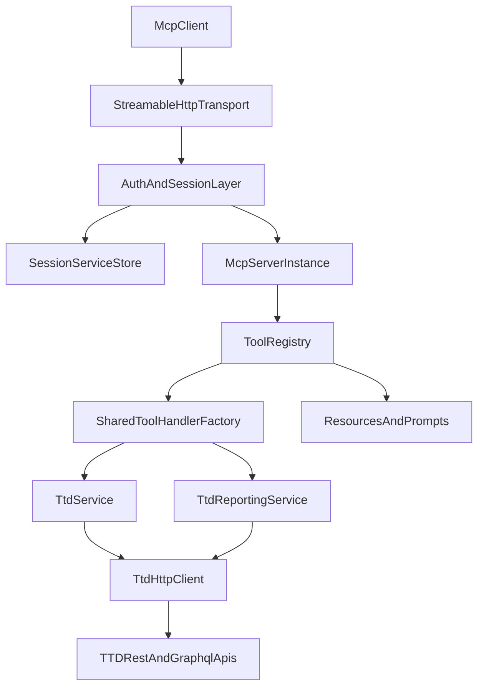

# ttd-mcp Architecture

**Version:** 2.0  
**Status:** Active  
**Last Updated:** 2026-02-15

## Overview

`ttd-mcp` is the The Trade Desk MCP server in the Cesteral monorepo. It exposes TTD campaign-management and reporting capabilities through MCP tools over Streamable HTTP.

Primary goals:

- Provide schema-validated CRUD workflows for core TTD entities.
- Support agent-friendly operations for batch changes and report retrieval.
- Keep request handling session-scoped so each MCP session carries its own authenticated TTD service graph.

## Architecture Diagram

## Directory Structure

- `src/index.ts` bootstrap entrypoint.
- `src/config/index.ts` typed environment config.
- `src/mcp-server/server.ts` MCP server construction and tool/resource/prompt registration.
- `src/mcp-server/transports/streamable-http-transport.ts` Streamable HTTP transport and session lifecycle.
- `src/mcp-server/tools/definitions/` declarative tool definitions.
- `src/mcp-server/tools/utils/` entity mapping, session resolution, validation helpers.
- `src/services/ttd/` TTD REST/GraphQL/reporting service layer.
- `src/services/session-services.ts` per-session service factory and store.
- `tests/tools/` tool logic and schema tests.
- `tests/integration/` transport-level request lifecycle tests.

## Core Components

### 1) Streamable HTTP Transport

File: `src/mcp-server/transports/streamable-http-transport.ts`

- Hosts `/mcp`, `/health`, and `/.well-known/oauth-protected-resource`.
- Enforces CORS + DNS rebinding protections.
- Negotiates auth strategy (`ttd-token`, `jwt`, `none`).
- Creates and tracks MCP sessions and per-session MCP server instances.
- Stores session-scoped services in `sessionServiceStore`.

### 2) MCP Server and Registries

File: `src/mcp-server/server.ts`

- Builds `McpServer` and registers all tools, resources, and prompts.
- Uses shared `registerToolsFromDefinitions` to standardize:
  - Zod parsing
  - request context creation
  - response formatting
  - structured error handling
  - telemetry and evaluator hooks

### 3) Tool Layer

Files: `src/mcp-server/tools/definitions/*.tool.ts`

- 18 tools across CRUD, reporting, bulk operations, and advanced GraphQL/query scenarios.
- Each tool declares:
  - `inputSchema`
  - `outputSchema`
  - `logic`
  - `responseFormatter`
- Parent hierarchy correctness is enforced via schema-level validation helpers in `src/mcp-server/tools/utils/parent-id-validation.ts`.

### 4) Session Service Graph

Files:

- `src/services/session-services.ts`
- `src/mcp-server/tools/utils/resolve-session.ts`

Each active session has a dedicated service graph:

- `TtdHttpClient`
- `TtdService`
- `TtdReportingService`

Tool logic resolves this graph by `sessionId` through `resolveSessionServices()`.

### 5) TTD Service Layer

Files:

- `src/services/ttd/ttd-service.ts`
- `src/services/ttd/ttd-http-client.ts`
- `src/services/ttd/ttd-reporting-service.ts`

Responsibilities:

- Entity CRUD and list/query operations.
- Batch workflows (bulk create/update/status/archive, bid adjustments).
- GraphQL passthrough.
- MyReports generation + execution polling.
- Shared rate-limiter and request-context propagation.

## Data Flow

1. Client sends JSON-RPC request to `POST /mcp`.
2. Transport validates protocol, auth, origin, and session state.
3. Session is created or resumed; session services are resolved.
4. Registered tool schema validates input.
5. Tool logic calls `TtdService` or `TtdReportingService`.
6. Result returns via MCP content (and structuredContent when applicable).
7. Telemetry and evaluator metadata are recorded for the call.

## Entity Hierarchy and Validation Model

Hierarchy source of truth: `src/mcp-server/tools/utils/entity-mapping.ts`.

Current strict parent requirements:

- `advertiser`: none
- `campaign`: `advertiserId`
- `adGroup`: `advertiserId`, `campaignId`
- `ad`: `advertiserId`, `adGroupId`
- `creative`, `siteList`, `deal`, `conversionTracker`, `bidList`: `advertiserId`

Validation helper behavior:

- Reads required parent IDs from mapping metadata.
- Resolves parent IDs from top-level params and/or TTD payload fields.
- Raises actionable schema errors when required parent IDs are missing.

## Security and Operational Controls

- CORS allowlist via `MCP_ALLOWED_ORIGINS`.
- DNS rebinding checks on `/mcp`.
- Auth modes:
  - `ttd-token` (preferred for per-session direct API tokens)
  - `jwt`
  - `none` (dev/testing)
- Stateful session timeout sweep.
- Per-partner API rate limiting before outbound TTD calls.

## Testing Strategy

- **Tool tests (`tests/tools`)**
  - Schema-level validation assertions.
  - Tool logic behavior with mocked services.
  - Response formatter checks.
- **Integration tests (`tests/integration`)**
  - `/mcp` session initialization and lifecycle.
  - End-to-end transport -> tool -> service mocking path.
  - Error propagation semantics from service failures to MCP responses.
- **Service tests (`tests/services`)**
  - HTTP client and TTD service behavior, retries, and edge conditions.

## References

- `README.md`
- `src/mcp-server/server.ts`
- `src/mcp-server/transports/streamable-http-transport.ts`
- `src/mcp-server/tools/utils/entity-mapping.ts`
- `src/mcp-server/tools/utils/parent-id-validation.ts`
